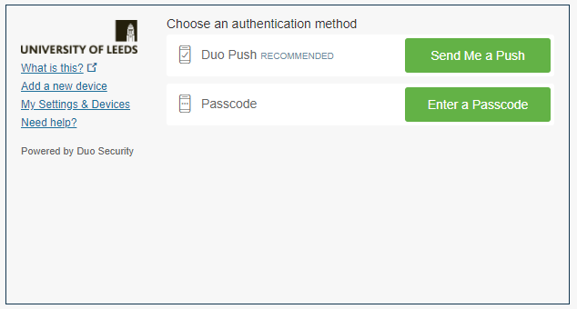
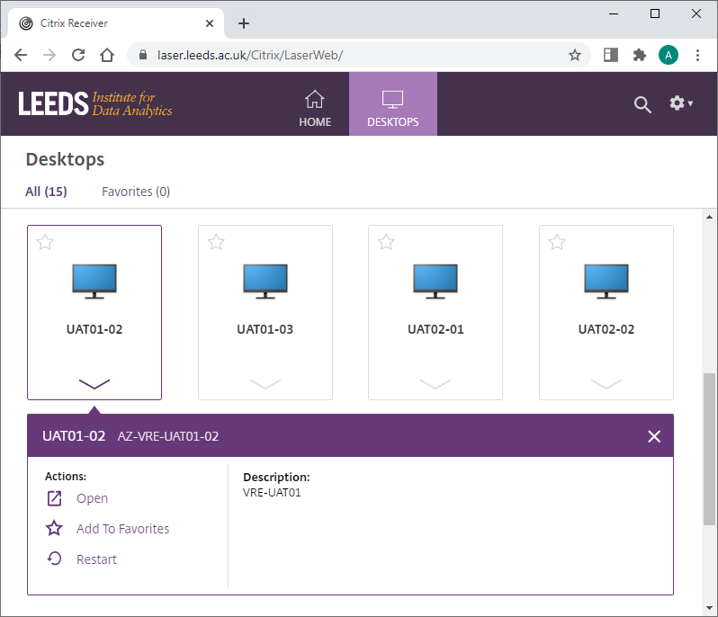
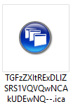
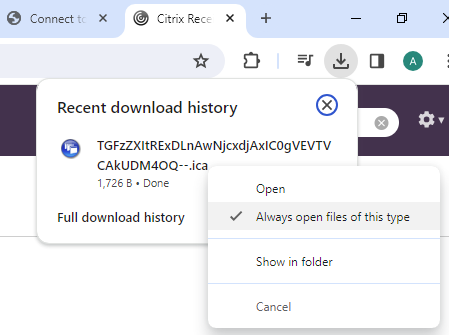
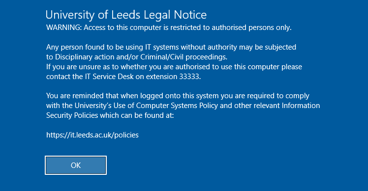
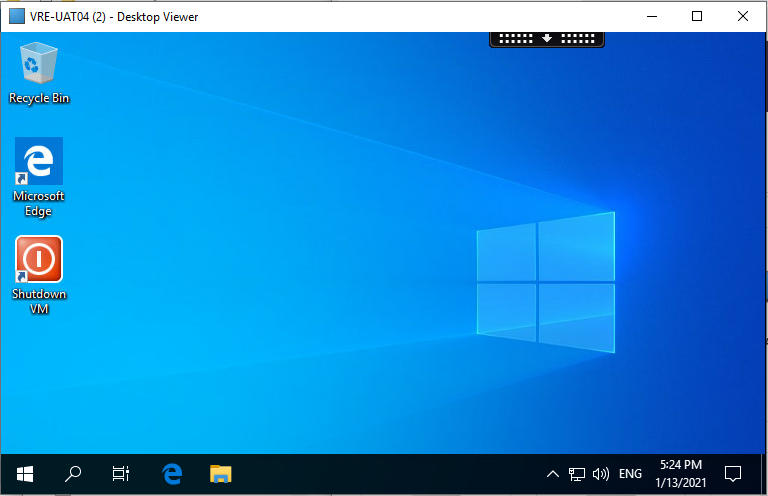

# Connect to a Trusted Research Environment
{:.no_toc}

* seed list
{:toc}

  

## Prerequisites

{: .important }
> Please ensure familiarity and compliance with any and all restrictions to the **_Territory_ you are permitted to access your data from** when logging in to your LASER TRE.  
> 
> This will most frequently be described by the **Data Sharing Agreement(s)** in place for your project and may **restrict the countries** (within and without the UK) from which you can **connect to your TRE**.  

You will need:
- Citrix Workspace installed to the machine you are connecting to LASER from. It's a good idea to [update Citrix Workspace](./troubleshoot.html#i-need-to-update-my-version-of-citrix-workspace) to the latest version.
  - On university managed devices, install Citrix Workspace via Software Centre. If you’re using a laptop from home and [Citrix isn’t in Software Centre](./troubleshoot.html#citrix-workspace-isnt-showing-in-software-centre), connect to the VPN to let Software Centre update.
  - If your university managed device is running Windows 11 you may be able to install via Company Portal. If it fails you will have to contact IT Services to install for you.  
  - On personal devices you can download and install the latest Citrix Workspace from [here](https://www.citrix.com/en-gb/products/receiver.html).  
- Duo two factor authentication enabled.
  - More information on DUO can be found [here](https://it.leeds.ac.uk/it?id=kb_article&sysparm_article=KB0014537).

## Log in to the Storefront
- Navigate to the StoreFront here: [https://laser.leeds.ac.uk/](https://laser.leeds.ac.uk/).
- Sign in using your University of Leeds credentials.
- When prompted, choose an authentication method and accept the login request/enter the passcode.  

- You may be asked if Citrix Receiver is installed:
  - Click to detect installation.
  - Allow browser to 'Open Citrix Workspace Launcher'.
  - If not detected but installation is present click 'Already installed'.
- You are now presented with all of the TRE desktops you have access to. Each icon represents a different virtual machine, and one TRE can have many.
- Click on the image of the monitor or expand the options and click 'Open' to connect. 
**Note that any failed attempt to open the chosen virtual machine will still cause it to start running in Azure and therefore incur costs. [Virtual machines can be stopped without logging in](./az_portal/portal_vms.html), via the Azure Portal, if needed.** 

  - You may be asked to download a *.ica launcher file.  
  
  - Save and open this file, it will be deleted when your session ends.
  - Configuring your browser to automatically open this file type will ensure a more seamless experience next time you connect. Example from Chrome browser below:
  
- Citrix Workspace will launch and connect to your chosen virtual machine
- You will  need to acknowledge the University of Leeds Legal Notice to continue. 
	- Failure to do so within 3 minutes will automatically disconnect the session, leaving the virtual machine running and incurring costs.
	- If this happens you can simply attempt to reopen the same virtual machine. It should open much more quickly as it is now in a 'Running' state.

- On clicking OK to the Legal Notice you will be presented with tour TRE desktop.  

