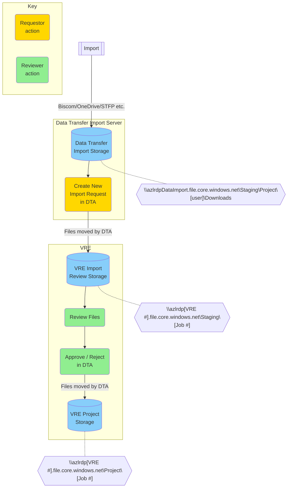
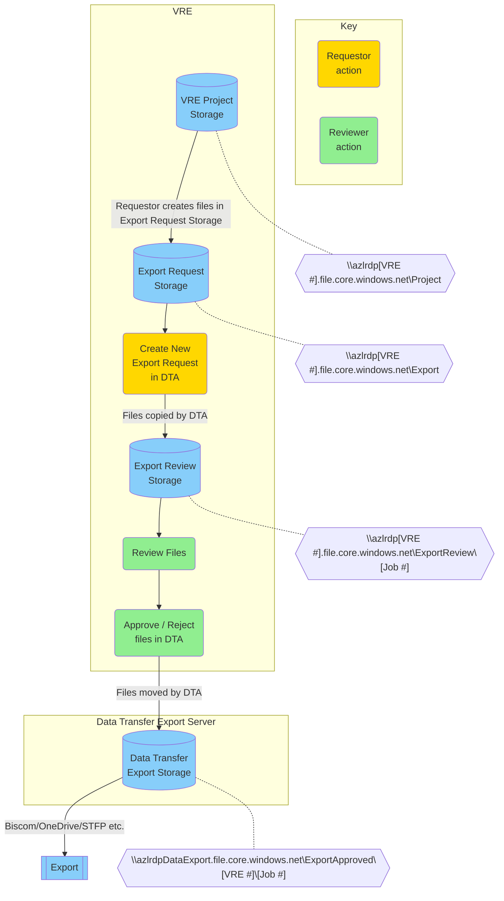

<!--{::options parse_block_html="true" /}-->
# Data Transfer App 

The Mermaid charts below can be viewed in [Markdown in repo](https://gitlab.com/lida-data-analytics-team/supporting-docs/-/blob/master/docs/sd/dta.md).

[Import Data Flow](#import-data-flow)  
[Export Data Flow](#export-data-flow)  
[Database Schema](#database-schema)  

## Import Data Flow

<!---->   

## Export Data Flow

<!---->   

## Database Schema

All tables populated by VRE build scripts or Data Transfer App, **except** for dbo.DataOwner and dbo.DSA. These tables must be populated by DAT.

### Asset Register
- List of assets that have been added
- Relates to AssetDSA

### AssetDSA	
- links AssetRegister with DSA
- likey decommed in future

### DSA
- AmendOf not used by App

### DataOwner
- RebrandOf not used by App	

### DataIORequest
- Lists all request jobs
- Request TypeID links to RequestType
- RequestedBy is GUID, linked to AAD
- RequestedReviewer 
	- All Reviewer = GUID of AAD group
- ReviewedBy is GUID of person who completed request

### FileRegister
- RequestID links to DataIORequest

### FileAuditLog
- File movements are stored here
- Links to FileRegister

### Project
- No impact other than ProjectCode must be same as in ActiveDirectory
- AD Groups are at VRE level, populated by build script using mid(string)

### VRE
- Storage account cannot be accessed without StorageAccountKey
	- Key Vault set up for each application resource group
- fileshare names must match names of fileshares in Azure
	

	
	
