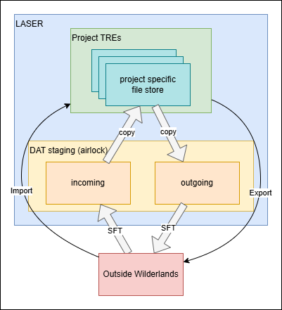

# LASER Data Transfers  

Data flow is strictly controlled to, from and within LASER.  

A useful handbook on Statistical Disclosure Control has been created by the Safe Data Access Professionals Group:  
[Handbook on Statistical Disclosure Control for Outputs](https://securedatagroup.files.wordpress.com/2019/10/sdc-handbook-v1.0.pdf)

---

[Data Import](#data-import)  
[Data Export](#data-export)  
[Using Biscom](#using-biscom)  
[Importing files sent via email](#importing-files-sent-via-email)

## Data Import

A request should come into the group inbox ‘dat@leeds.ac.uk’, to transfer files
into a VRE within LASER.

- The [LASER SFT](#using-biscom) is the preferred method of transmission. Circumstances may dictate that other means are used, for example NHS policy is to use their own SFT and nothing else. For Tier 3 sensitivity and above a secure transfer mechanism must be used, i.e., not email attachments or Dropbox, etc.
- Once a method of transfer has been agreed the files should be brought into the data staging area of `\\datstagingdata.file.core.windows.net\incoming`. Save the files to a date stamped folder, within an appropriate project folder. For example: `\\datstagingdata.file.core.windows.net\incoming\P####\YYYY-MM-DD\` 
- Check the files for compliance with the currently live data management plan and/or data sharing agreement as appropriate.
	- If non-compliances to the Data Sharing Agreement are found then escalate to the DAT Manager or LIDA IG Manager.  
	
>>
It may be necessary to obtain additional information from the researcher or data supplier in order to ascertain compliance. Example questions include:
- What does each file contain?
- What data, if any, is contained within each file?
- From where was it sourced?
- What risk classification is this data?
- Has this been captured by the data management plan?
>>

- If transformations are required perform them as necessary. It is prudent to complete this work instruction for files received before beginning the transformation process, so that all transfers are recorded in an accurate and timely fashion. Keep derived files separate from received files.
- If files are to be imported to a VRE they can be copied from `datstagingdata` into a date stamped directory within an Incoming folder within the root of the shared directory of the correct VRE file store, for example:  
	`\\azlrdp<VRE NAME>.file.core.windows.net\project\Incoming\YYYY-MM-DD\`. 
- Details of the transfer must be recorded in Prism.
- Send notification to all interested parties that the files have been received and are now available from within a VRE (if available from within a VRE).

## Data Export  

>>
A set of questions has been agreed that we should ask all researchers who request outputs from LASER. We should only release the files if we are satisfied with the answers to the following questions:  
- What does this file contain?
- What is the source data for this file?
- How was this file generated?
- What measures have been taken to minimise disclosure risk?
>>

- Create a date stamped folder within a project folder within `\\datstagingdata.file.core.windows.net\outgoing`, e.g.,  
	`\\datstagingdata.file.core.windows.net\outgoing\p####\YYYY-MM-DD\`
- Copy the files that have been requested into the newly created, date stamped folder.
- Email the requestor asking them to answer the above questions for each file if the answers are not already apparent from the request.
- Check each file against responses and relevant Data Sharing Agreement (DSA).
- When we are satisfied with the responses to the above questions and have confirmed that the files scheduled for release are within an acceptable threshold for disclosure, they can be sent to the researcher via the [LASER SFT](#using-biscom).
- Email the requester (and cc recipients if different) to let them know their files have been exported and how they can access the files
- Record the transfer to Prism

## Using BISCOM

Biscom creates a time limited link between an individual and ourselves, by which files can be transferred. We create the link by sending a message from Biscom when logged in to the DAT account.  

> Only organisational accounts of individuals can be recipients of Biscom messages.

To create a transfer linkage with an individual:
- Log in to Biscom using the DAT teams group credentials (found in KeePass)
	https://laser-sft.leeds.ac.uk/sft/Login.do
- Click on 'Compose Delivery' and compose the message:
	- To: Enter the recipients email address
	- Subject: Type the project number and project name
	- Date Expires: Defaults to 90 days time
- If setting up a transfer for import:  
	- Message Body should include some basic instruction to attach files to a reply to send them to us
	- Click 'Send'
- If exporting:
	- Message Body should include some basic information theat the files are available for download 
	- Drag files on to 'Uploads' area of screen or click 'Attach Files', navigate to and select files to export
	- Click send

The recipients will then be sent an automated notification that contains a link they can follow to register to use the platform. Once registered and logged in they will see your message to them and either their files will be available for download or they can attach files to a reply to your message to send them to us.  

Recipients will be able to use the Biscom link in the same manner to send files to us for as long as it stays active. The replies will appear in the 'Inbox' and the files will be available to download. Follow the [Import Process](#data-import) detailed above.

### Permanent Biscom links

Biscom link will expire by default, but we can create a permanent link if there's a need that cannot be fulfilled with a temporary link:
- Log into Biscom using the DAT account
- Go to Packages in the left hand menu
- Create a new package from the top right corner
- Give the package a name and click save
- Log into Biscom using the admin account, find the new package, delete its expiry date and click save
- Using the DAT account again, find the new package and click "Send delivery" from the top right corner
- Follow the steps [above](#using-biscom) to create a transfer linkage as normal, except you will also delete the expiry date before clicking send.

project n: = \\\azlrdp\<VRE NAME>.file.core.windows.net\project  
project s: = \\\azlrdp\<VRE NAME>.file.core.windows.net\staging  

imports = \\\datstagingdata.file.core.windows.net\incoming  
exports = \\\datstagingdata.file.core.windows.net\outgoing  

BISCOM = https://laser-sft.leeds.ac.uk/sft/Login.do

DAT02 Public IP: 20.49.212.144/28 (which is the 14 addresses: 20.49.212.144 - 20.49.212.159)

## Importing files sent via Email

Sometimes project onwers and LASER users send files to be improted into the VRE through emails. This must be non-sensitive files such as scripts/codes etc. 
Follow this process below to import non-sensitive files sent through email into the project's VRE on LASER.

- Login to DAT02, open and login into OneDdrive <https://outlook.office.com> in a web browser using uitirc@leeds.ac.uk email address. Password is saved on KeePass on N drive.
- Download the files into the project's Incoming folder on imports \\\datstagingdata.file.core.windows.net\incoming\P####\YYYY-MM-DD
- Open the files to make sure they're the right files and should be on LASER.
- Open the project's  N drive \\\azlrdp\<VRE NAME>.file.core.windows.net\project  and save file on the incoming folder
- Inform researchers/users the location of the imported files.
- Record the file transfer log on Prism.

---

