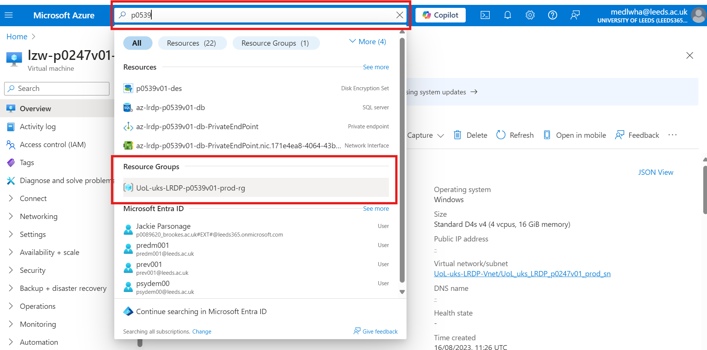
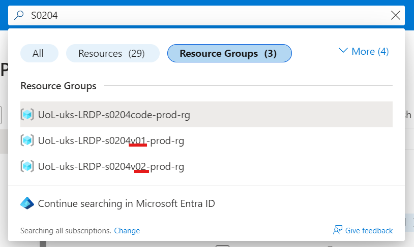
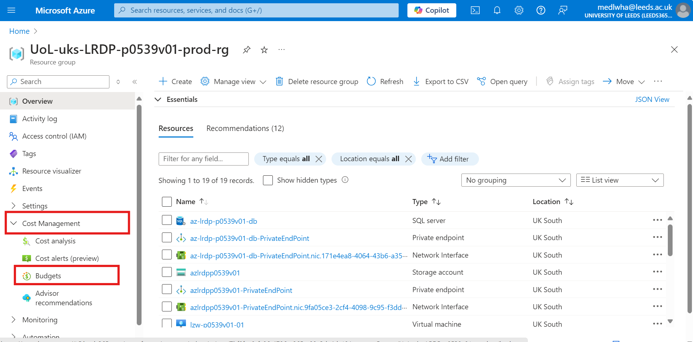
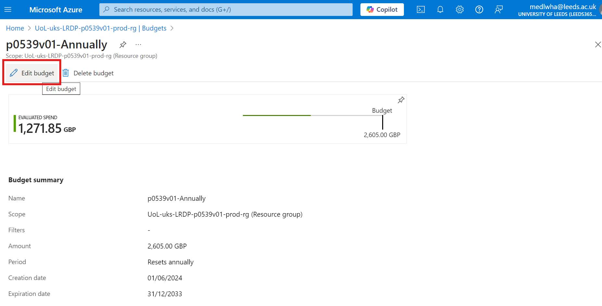

# Cost estimate  

Once the proposal is complete, create a ServiceNow request for a LASER cost estimate. 
- Ensure ticket number is added to project Notes in Prism

You will receive an email with a spreadsheet attachment containing the cost estimate for the project.
Save this spreadsheet to the project folder on OneDrive:  
	
	LIDA - Data Services Team\General\LASER\Projects\P####\keydocs

Open the template costing email and copy the relevant items from the above costing spreadsheet into the table it contains.  
	
	LASER Project Costing vx.oft
	LIDA - Data Services Team\General\LASER\Comms and Presentations\Email templates  

~~> _LASER Service Fee_ is calculated by multiplying '_Azure Resource Provision_' Total Costs by the Recovery Ratio, currently set to **0.66**.~~  

Send the email to the PI and Lead Applicant, ensuring Gareth Bancroft, Adeel Hussain, Jodi Gunning and the [relevant Faculty Research Manager and Office](../../sd/info/dramatis_personae.md#faculty-research-managers) are cc'd. 

Go to the project record in Prism and add the costing details (including DAT Support FTE) to the 'Costings' form. Remove any previous costings that are no longer valid. 

Researchers may need to refine requirements to adjust cost. Ensure this is documented in the proposal (creating new versions if necessary) and making additional ServiceNow requests (or refinements through comments on the original request) as necessary. This can be an iterative process; please ensure Prism is updated as appropriate at every step.  

Once everyone is happy with costs mark latest version of the proposal as 'Accepted' in project record in Prism and update stage to 'Pre-approval'.  

Save a copy of the acceptance email to the project folder:  

	LIDA - Data Services Team\General\LASER\Projects\P####\keydocs\2_laser_costing

# Extension Cost estimate  

The original cost estimates come with monthly rates; we can use those if it was generated within the last 12 months. Otherwise we can put in a request just the same as for a new project. Make sure to include in the 'additional information' that this is for an extension, as build costs can be ignored (but destruction costs retained).  

# Updating Azure Budget

Prepare by opening the excel file containing the new costing for the project.

Log on to Microsoft Azure and navigate to the projects Resource group. This example will use P0539.

Be mindful that some projects have multiple tiers with their own allocated resource groups. For example, S0204 has a tier 4 resource group (UoL-uks-LRDP-s0204v01) and a tier 3 resource group (UoL-uks-LRDP-s0204v02), so it's always best to double check. For P0539 there is just one resource group.

Once you have navigated to the correct resource group, find and expand 'Cost Management' in the left hand menu. Next, click 'Budgets' from the expanded menu.

The next page will now show Annual and Monthly Budget. Select Annual Budget

From here select 'Edit Budget'. Scroll down to 'Budget Amount' and type in the new budget.

The new budget is calculated by subtracting the VAT from the total in the cost proposal. This can be achieved by dividing by the total by 1.2.

Click next and then click save. You will be redirected back to the Budgets page. This page may show both the old budget and the new one. Give it a few minutes and it will be corrected.

Next select the monthly budget. To change the monthly budget follow the same steps as the annual budget and then also divide the amount by 12.
