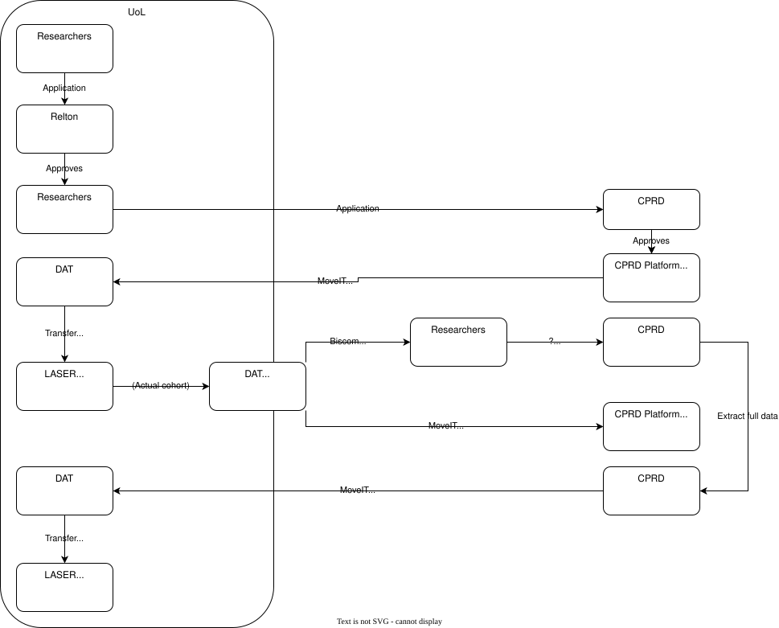

# CPRD Projects Data Transfer Work Instructions

The following projects are CPRD projects under the CPRD Multi-License Agreement with the University of Leeds.

## Applicable Projects
This guideline applies to the following projects:

- **P0247**
- **P0342**
- **P0451**
- **P0569**
- **P0582**
- **P0585**
  
## File Transfer Methods

For LASER projects involving CPRD data, there are two file transfer methods:

- **LASER SFT (Biscom)**
- **CPRD MoveIt**

### Access to MoveIt
To gain access to the MoveIt platform, you (as a member of DAT) must be added as a collaborator to the project on the **eRap** platform.

### LASER SFT (Biscom)
Files from the UoL CPRD group can be received and sent through LASER SFT (Biscom).  
When setting up an import request, ensure the Biscom link is configured for an active duration of **90 days** (instead of the standard 30 days for regular LASER projects).

### File Naming Convention
All data files should follow this naming format:
LASER project code > CPRD project ID > other file identifier

**Example:**  
`P0451_23_003447_patID.csv`

## Data Flow Diagram
The image below illustrates the data flow:

