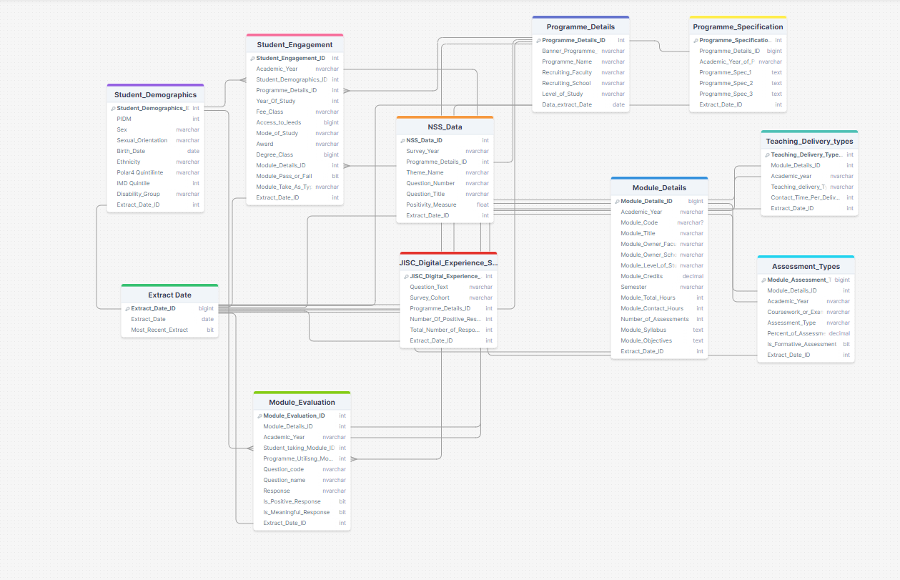
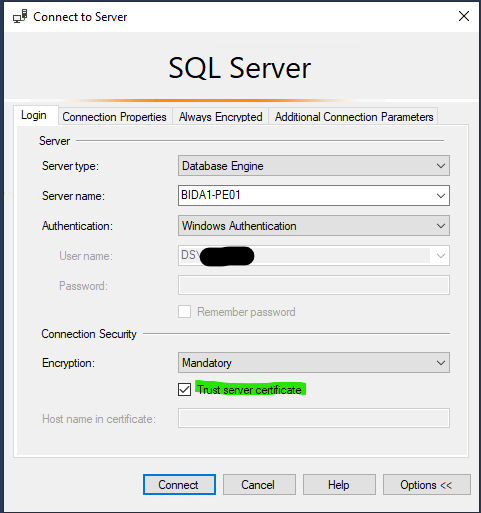
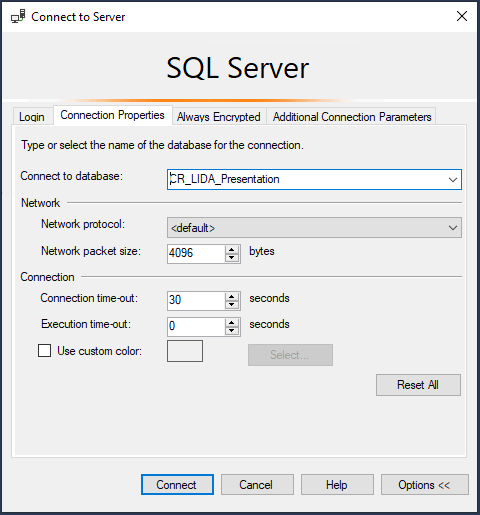
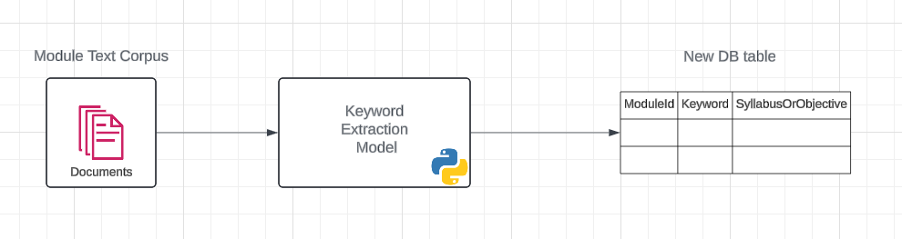
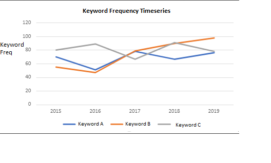

# Data Architecture
The project data is collated in a database owned by BIDA, of a schema specification that was defined in early project meetings. The database is called **CR_LIDA_Presentation** and is managed by Thomas Ravenhall.



The project data is organised so that BIDA will create an updated extract of the defined dataset, from their source data, on an annual basis. This will need to be ingested into the TRE (P0539) database on this cycle. 

# Data Ingress
## Establish Data Connection
The BIDA SQL Server owner/data engineer, Gary Taylor has added DAT02 to the firewall whitelist to allow a connection to the on-prem BIDA server, **BIDA1-PE01** (IP: 129.11.80.24) using the `lida_dat` login.The password for this SQL Server Login is stored in the password safe under the project folder P0539. 

Full BIDA1-PE01 ipconfig details:
- Connection-specific DNS Suffix . : ds.leeds.ac.uk 
- IPv4 Address. . . . . . . . . . . : 129.11.80.24 
- Subnet Mask . . . . . . . . . . . : 255.255.255.0 
- Default Gateway . . . . . . . . . : 129.11.80.103 

A Cloud Platform Team Engineer then had to augment the Azure Firewall rules to allow the SSMS on DAT02 to communicate with BIDA's SQL server. The following rule was added:
```
Network Rule Collection: Laser
Priority: 1000
Action: Allow
Name: Laser-Dat02-BIDA1-PE01
Source Address: 10.6.8.134
Destination Address: 129.11.80.24
Destination Port: 1433
Protocol: TCP
```
## SSMS Login
Regarding credentials, there is a local Windows group set up on BIDA1-PE01 for access to CR_LIDA_Presentation. For access CR_LIDA_Presentation directly, via say SSMS, currently:
- Adam Keeley
- Chris Andrew 

are members of this group and use their standard NT usernames, with _readonly_ access to the DB. 

Ensure the login settings as seen in the following images for a successful and **secure** connection:





## Data Ingestion Method
From DAT02 a few options have been identified for possible data ingestion: 
1. ~Setup Linked Servers: using SMSS. This would be the easiest option, but may not be possible due to LASER networking constraints.~ 
2. ~Use cmd line [`bcp`](https://learn.microsoft.com/en-us/sql/tools/bcp-utility?view=sql-server-ver16) tool: this provides an efficient way of exporting/ingesting data between servers.~ NOT INSTALLED
3. Custom linkage/ingestion tool: the [version of the tool we have available](https://techcommunity.microsoft.com/t5/azure-database-support-blog/lesson-learned-469-implementing-a-linked-server-alternative-with/ba-p/4023187#:~:text=While%20a%20direct%20Linked%20Server,flexibility%20and%20robust%20error%20handling.) is written in C# and would require a .NET SDK installation on DAT02.

We've gone with option 3. and written a C# wrapper console app around the class from that blog. Our implementation can be found at the following [Github repo](https://github.com/LIDA-Data-Analytics-Team/p0539-curriculum-redefined).

The data will have to be loaded into the TRE DB on a table by table basis in a way that it doesn't aggravate any constraints/dependencies. The order is as follows: 
1. Extract_Date
2. Student_Demographics
3. Programme_Details
4. Programme_Specification
5. Module_Details
6. Module_Teaching_Delivery_Types
7. Module_Assessment_Types
8. Module_Evaluation
9. Student_Engagement
10. NSS_Data
11. JISC_Digital_Experience_Survey_Q43

## Data Ingestion Tool Usage
1. Confirm the `Extract_Date` table on the BIDA server has a new/recent row with Recent Extract flag tagged. 
2. The user running the code must have their credentials (username) entered for each of the two connection strings in the `RunTableTransfer()` method of `Program.cs`. The TRE database credentials can be found in KeePass.
3. `dotnet run --no-restore`: There's clearly a problem doing `dotnet run` in DAT02. It tries to hit some NuGet endpoints online which is obviously a non starter. To get round this, you'll have to build it first on your local machine (`dotnet build`), then copy the cached Nuget files from your local build, and restore from them. The best way to get the correct packages is to first clear your nuget package cache using Visual Studio menu: Tools → Options → NuGet Package Manager → General: Clear Package Cache button. Then rebuild the console app. (The key dependencies here are the folders in the `C:\Users\<your-username>\.nuget\packages` directory.) This [SO tells you which files](https://stackoverflow.com/questions/55320541/dotnet-run-restore-without-internet-offline-mode) might work, and the dotnet commands to run with `-no-restore`. So the process to build and run looks like:
```
dotnet restore --source C:\parent\path\of\imported\dependencies
dotnet build --no-restore
dotnet run --no-restore
```

4. It is useful to confirm the row count of the new data (on each annual ingestion event) at source and target to confirm there have been no errors in the ingestion pipeline.

 
# TRE Notes
- It should be noted that `lzw-p0539v01-01` is a higher spec, D8s, VM: commissioned in the event that some of the NLP work would require higher processing power. With that in mind, for cost reasons, it is best to use the 02 and 03 VM's in preference of the 01 VM if standard workloads are required. Remind researchers of this.
- Only `db_datareader` role access is required for the new/majority of project researchers, except for the assigned DAT member and Thomas Ravenhall (BIDA).

## Power BI reports
It has been agreed that the DAT will get the TRE into a position that the researchers will be able to consume the database data from within Power BI. The research team will create the Power BI reports for themselves. 

These will be within two themes: 
1. Scatters: A report for each independent variable of interest, containing scatter plots of the six/seven key dependant varialbes. (see slide 9 of "CR_Research_Project_Away Day 2_040724" deck) - there will be a single `.pbix` workbook/project for this. 
2. Time Series: reports with time series charts (by year) to help explore questions such as how do the number of modules change over time. 

Both will be filterable for a range of parameters

# NLP Notes
## Methodology Exploration
- **Keyword extraction**/keyword frequency time-series analysis - could filter/drill by module/programme/faculty - potentially better for visualisation of the timeseries/less uncertainty. - There are multiple keyword algorithms available - should compare/test their efficacy - eg rake, gensim
- From the UBC paper: "[ingest, store], extract, and analyse text from faculty provided syllabus documents"
- **Symmetric semantic search**: "extract the 3 most semantically similar sentences to a particular [~flexibility~] guideline" - requires very clearly defined guideline parameters/codings - then matches those guidlines to nearest simillar vector embeddings in the corpus/documents
- Maybe we want: **asymmetric semantic search** - a few keywords map to range of size results? (Should probably clearly define size of keyword  array to have clearly defined outputs)
- Does it need to be clearly defined over which parts of the modules/programmes texts etc. that we run these models? 
- CR has a relatively small corpus - pretrained models.
- Interesting to see the timeframe laid out in the UBC paper - helps set realistic goals for CR - UBC 'team' working potentially close to full time/ vs. a single engineer/data scientist working 40%  - double/triple their timeframes - then double again (a first rule of engineering). (Then add the dashboard work for the structured data) 
- Still to see the format held in the dbs - is it html encoded? - but it looks like there'll be quite a lot of pre-processing/scraping required - (split tabular data, text etc. )

## Broadly Agreed Approach
During the Away Day (20240704), the following approach to the NLP analysis was considered and broadly agreed. The analysis would be approached in two steps (by the incoming RSE, ~Oct2024): 
1. Keyword Extraction 
2. Semantic Search

### Keyword extraction
As roughly [described above](#methodology-exploration), a rudimental keyword analysis of the module syllabus and objectives texts would be useful for data exploration purposes. This would involve running the Module corpus texts (stored in the `Module_Details` table) through a suitable extraction model, (eg. Rake, Gensim) and adding the model output to a new table in the research database.



This new table could then be imported into the PowerBI reporting tooling and used for exploratory purposes, aggregation and graphing, for example creating timeseries analysis of the collections of related/important keywords: 



Other relationships between keyword frequency at certain time-points could be explored against other dependent variables of interest.  

### Semantic Search
Following on from the Keyword extraction approach, some form of semantic search analysis will be performed to obtain some level of  nuance in the result output. This methodology will be analogous to the [UBC report approach](#useful-reference), but it has been discussed that some subject matter experts should help define the encoding questions/sentences for the **symmetric** approach. It has also been discussed that an **asymmetric** approach could also be beneficial (where instead of sentence encodings, a collection of keyword encodings could be used instead) - the keyword collections would also need to be defined by subject matter experts.

Like the keyword extraction methodology, the sematic search processing could take place in one iteration and the results stored in the research database for further analysis against the structured data.

## Useful Reference: 
- [UBC's symmetric semantic search project](https://cic.ubc.ca/project/determining-course-flexibility-from-syllabi/), the [Github repo](https://github.com/UBC-CIC/course-flexibility/tree/main), but most usefully see the UBC 'Flexibility' report/paper stored in LASER project P0539 folder `7_research_docs`
- [An overview of semantic serarch](https://www.sbert.net/examples/applications/semantic-search/README.html)
- [Python Library: Sentence Transformers Documentation](https://www.sbert.net/docs/sentence_transformer/pretrained_models#sentence-embedding-models)
- [Hugging Face: Sentence Transformers](https://huggingface.co/spaces/sentence-transformers/embeddings-semantic-search)