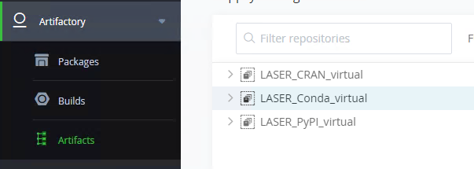

# Artifactory 
{: .no_toc }

LASER now has a means to provide air gapped access to online package repositories that you can use from within your offline VRE. We are currently able to provide access to CRAN, Conda and PyPI repositories. Here you will find everything you need to know to gain access to them. These are one time configuration steps that will persist between sessions, but will need to be repeated for each VM you log in to within your VRE.

## Setting up artifactory 
{: .no_toc }

The following 6 steps are common across the configuration of each artifactory mirror. 

1. From a web browser within your VRE navigate to 10.6.8.132:8082/ui.
2. Log in using your UoL credentials.
3. In the left hand menu click Artifactory --> Artifacts.  
	
4. Choose a **virtual** mirror
	- LASER_CRAN_virtual 
	- LASER_Conda_virtual 
	- LASER_PyPI_virtual 
5. At the top right of the screen click on 'Set me up'.  
	
6. Enter your UoL password to hash and insert your credentials into the generated code snippet.  
	

Now continue to follow the package repository specific instructions below:
- TOC
{:toc}


### CRAN

Select LASER_CRAN_virtual in step 4 above.

The code snippet will be generated directly below the password field in the 'Configure' tab.

Replace the contents of your Rprofile.site file with the generated code snippet.
Rprofile.site can usually be found at C:/Program Files/R/R-x.x.x/etc/

You can now install packages using
```R
install.packages(<PACKAGE>)
```


### Conda 

Select LASER_Conda_virtual in step 4 above.

The code snippet will be generated directly below the password field in the 'Configure' tab.

Open anaconda python and run command to generate .condarc file 
```python
conda config
```

Find the .condarc file in C:/users/<username>, open in notebook and replace contents with the code snippet generated by Artifactory

You can now install packages using
```python
conda install <PACKAGE>
```


### PyPI

Select LASER_PyPI_virtual in step 4 above.

The code snippet will be generated in the 'Resolve' tab.

Replace the contents of the C:/ProgramData/pip/pip.ini file with the code snippet containing your hashed credentials.

You may need to manually create the /pip/ directory and pip.ini file. C:/ProgramData is hidden by default so you may need to enable 'Hidden items' if you are using Windows Explorer to find it.

Append the following to pip.ini:
```python
trusted-host = 10.6.8.132
```

The full contents of pip.ini should look something like this:
```python
[global]
index-url = http://<USERNAME>:
<PASSWORD>@10.6.8.132:8081/artifactory/api/pypi/LASER_PyPT_virtual/simple
trusted-host = 10.6.8.132
```

You can now install packages using
```python
pip install <PACKAGE>
```
