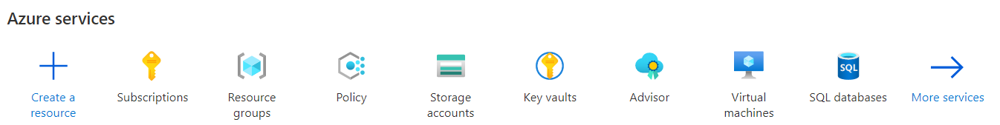
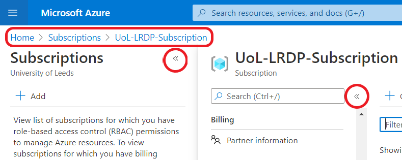
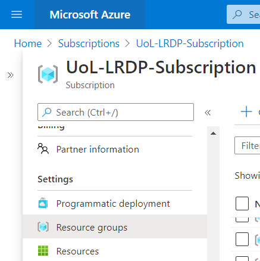

# Using Azure Portal

Microsoft Azure has an online portal, which you can use to monitor various details about your LASER VREs, including running and forecasted costs. There are many things you can do with Azure Portal, most of which are out of scope of LASER documentation. To understand more about Azure Portal and services generally, visit [Azure Portal documentation](https://docs.microsoft.com/en-us/azure/azure-portal/azure-portal-overview). Our documentation will focus on guiding you to parts of the portal where you can monitor basic information about your VREs.

To use Azure Portal, go to [https://portal.azure.com/](https://portal.azure.com/) and log in using your University of Leeds account credentials. The home page will link to various core services and recently viewed information. Near the top of your home page, you should see a list of services that will look something like this:

{:width="100%" .mx-auto}

Select the Subscriptions button, with the yellow key. You'll see a list of subscriptions you have access to and, if you have access to LASER, this should include the LASER subscription, called UoL-LRDP-Subscription. Select this subscription to enter a part of the portal that contains everything associated with the LASER environment.

Before we go any further, it may help to briefly explain some basics about navigating the portal. After entering the LASER subscription, the top left of your page may look like the screenshot below.

{:width="70%" .mx-auto}

At the top, highlighted in the red rectangle, is the breadcrumb: a hierarchy of the levels you have explored, which you can use to easily go back up a level.

Each level in the hierarchy typically pops up a new navigation menu on the left hand side, or replaces one previously visible. To collapse a menu, select its collapse arrow, which we've highlighted in red circles.

You will typically navigate through the portal by selecting a resource in a navigation menu, then returning by moving back levels in the breadcrumb.

Now, from the LASER subscription page, scroll down the mavigation menu and select Resource groups, as shown:

The page will then list the resource groups you can access. Each resource group is a different VRE. The resource group ID contain your VRE's ID, e.g. p0000v01. The full resource group ID will take the form `UoL-uks-LRDP-<vre id>-prod-rg`. Select a resource group for one of your VREs and follow the next pages to see what VRE information you can monitor using the portal.
