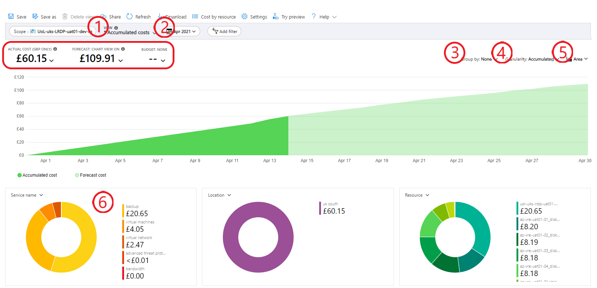
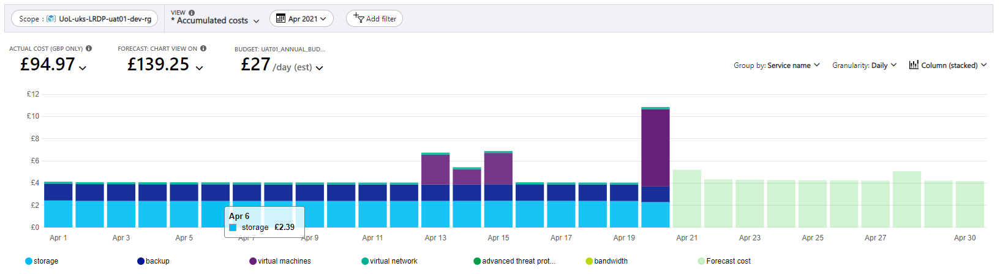

# Monitor VRE Costs in Azure Portal

Detailed information about running and forecasted costs can be viewed for each VRE in Azure Portal. The costs can be compared with your project's budget, which is determined during your engagement with LIDA as part of [LIDA's Research Management Process](../../../docs/lida_services/RMP.html).

To monitor costs consumed by your VRE, follow the steps on our [Portal Basics page](./portal_basics.html) to find the portal page for your VRE (otherwise known in the portal as a resource group). The overview page for your VRE will appear. Scroll down the navigation menu on the left to find the Cost analysis page, in the Cost Management section.

When you open the Costing analysis page, you'll see a collection of plots summarising the cost of your VRE, over time and grouped by multiple variables:

{:width="100%" .mx-auto}

## Cost fundamentals and budgets

The screenshot above is annotated to guide you. The numbers highlighted in the red rectangle are the most fundamental information on this page: the actual cost and forecasted total cost within the specified timeframe, both compared with the project's budget.

In the screenshot above, you'll see that the budget is omitted here. In your case, you will have a budget and this will be added as a reference point in the costing graph in centre screen.

Budget alerts are set up for every VRE to keep you apprised of running VRE costs and prevent overspending. The project PI is alerted via email when the monthly or annual costs spent reach 25%, 50%, 75% and 90% of the allocated budget. If you are concerned about spending your budget too quickly, please contact the [Data Analytics Team](mailto:dat@leeds.ac.uk) to discuss further.

## Detailed costing information

The screenshot above includes six numbered annotations, guiding you to parts of the Costing analysis page that will help you transform and summarise the costing data in various ways.

1. **View**: A dropdown list to change the data visualised in centre screen. The default view is Accumulated costs, which present cumulative costs spent over time. Another useful view is Cost by resource, which presents a table showing the cost of each VRE component in the specified time frame (adjusted at point 2). You can also create custom views by making changes and clicking save in the top left, giving you customised reports you can come back to repeatedly with little effort.
2. **Timeframe**: Specify start and end dates for the time period for which you want to visualise costs. Note the costs will update when you change the timeframe, but the budget _may_ not as this is fixed to a given duration (i.e., monthly or annual).
3. **Group by**: Group your accumulated costs in various ways to better understand what is costing you the most money. For example, select Service name from the dropdown to compare the cumulative costs over time for storage, virtual machines (compute), backups, and more. If you're forecasted over budget and virtual machines dominate the cost, check that the [virtual machines are turned off when not in use](./portal_vms.html).
4. **Granularity**: You can change the y-axis of the plot from cumulative cost to daily or monthly amounts, which can help identify spikes in VRE usage and associated cost.
5. **Chart type**: Change the chart type from area to line or bars to better visualise the data for what you need to understand.
6. **Cost proportion summaries**: Shows a basic breakdown of costs by service type or any other variable, so that you can whether storage, compute or something else accounts for the greatest proportion of your costs (and much more by changing the grouping variable).

## Custom views

Combine the options above to create your own personalised views of VRE costs. For example, try the following options: 1. Accumulated costs view, 2. "This month" time frame, 3. Group by "Service name", 4. "Daily" granularity, and 5. "Column (stacked)" chart type. These settings will produce a graph something like this:

{:width="100%" .mx-auto}

This plot clearly shows three useful things:
1. On what days the VRE is most in use; When the VRE is being used, the virtual machines will be switched on and running costs, shown above in purple.
2. The "background" costs of the VRE, which accumulate even when the VRE is not in use (roughly £4 per day in the above plot).
3. Peak daily costs when the VRE is being used a lot (daily peak in the above plot is on 20th April at roughly £11).

Once you've created a view you find useful, click the save button in the top left and give it a useful name. You can then revisit your customised view whenever you want by selecting it from the View dropdown list (option 1 described earlier). You can also download graphs and data for reporting elsewhere, by hitting the download button.

Spikes in resource group costs can occur during the lifetime of a project, some of the reasons may be :
- During initial project resource group creation and configuration
- During the on-boarding of databases into the resource group when the database is scaled up in capacity to migrate the data
- During the on-boarding or archiving of large amounts of project data into the resource group particularly at project outset
