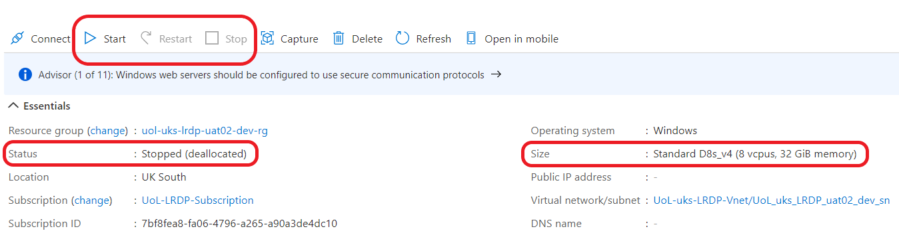

## Monitor Virtual Machines in Azure Portal

To monitor information about the Virtual Machines (VMs) in your VRE, follow the steps on our [Portal Basics page](./portal_basics.html) to find the portal page for your VRE (otherwise known in the portal as a resource group). Once there, you should see a table listing the resources inside your VRE that are visible to you. This list should contain the same number of VMs that your VRE contains. The VMs will be named with their unique ID, e.g. lzw-p0000v01-01. You can identify VMs by matching this ID with the corresponding VM IDs shown in the LASER Storefront (where you log into your VRE).

Select one of your VMs to monitor information about that VM. You should now see a page of information about your chosen VM, like shown:

{:width="70%" .mx-auto}

### Stopping a VM

You will see buttons near the top to start, restart or stop a VM. You will probably never need to start or restart a VM using this method, because [accessing your VRE via the LASER Storefront](../../../docs/laser_how_to/laser_login.html) will start the VM for you.

**However, knowing how to stop a VM may help you avoid any unnecessary project costs. Some of LASER's Azure resources are costed on a pay as you go basis, meaning that if something is left on when not in use, it will unnecessarily use up your project's budgeted costs.**

If you select the Stop button, the VM will shut down any allocated resources and the VM's status will change to Stopped (deallocated) as described below. **Beware that if anyone is using the VM while you stop it, their access will be cut off and they may lose unsaved changes. Always first speak with your group members to understand what's in use.**

### Checking VM size and status

In the Essentials box, you will see the VM status and size.

The VM size shows which Azure VM model you have been assigned. The model shown in the screenshot above is model D8s_v4. In parentheses, you'll see the number of cores, shown as vcpus, and amount of RAM memory associated with this VM model. You can see in the screenshot that a D8s_v4 VM contains 8 cores and 32 GiB memory.

The VM status shows whether the VM is in use and accruing costs. There are three main at-rest statuses: Running, Stopped, and Stopped (deallocated):

1. Running: The VM is in use by a member of your research group. **While in use, it will be costing your project money.** If you see a VM running that you suspect nobody is using, a user may have disconnected, intentionally or otherwise, rather than signing out. In this case, we recommend you discuss with your group members to establish whether anyone needs this VM running and if not stop the VM to prevent unnecessary project costs.
2. Stopped: The VM is not in active use, however **Microsoft Azure resources have not been deallocated and therefore costs are still being accrued. If user's sign out correctly, using [our instructions](../../../docs/laser_how_to/laser_logoff.html), the VM Stopped status should change to Stopped (deallocated) after a maximum of 20 mins.** If you suspect the VM has been in Stopped status for longer than 20 mins, stop the VM to prevent unnecessary project costs. Before stopping, double check whether anyone in your group is trying to use the VM.
3. Stopped (deallocated): The VM is stopped and in a dormant state. **It will not be accruing any pay as you go costs associated with using the VM.**
4. You may also notice other transient states, such as Stopping or Updating - these aren't important and don't affect project costs.

The VM status is determined by whether the VM is in use, and also which method is used to close the VM. For instructions on how to close a VM after use without incurring further running costs, see [our instructions on closing a VRE](../../../docs/laser_how_to/laser_logoff.html).
