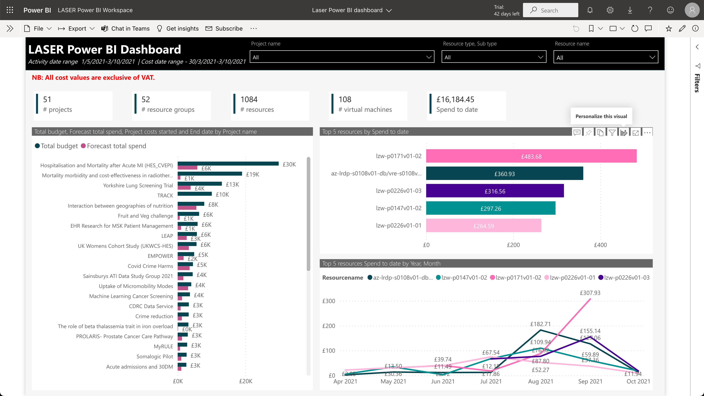
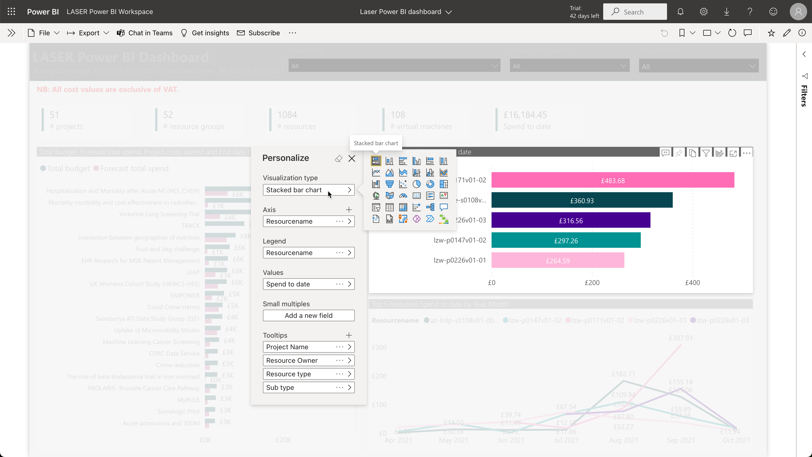
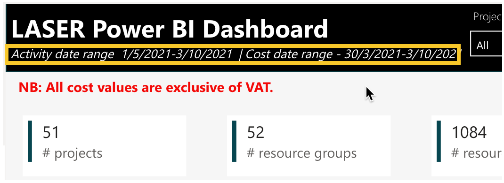
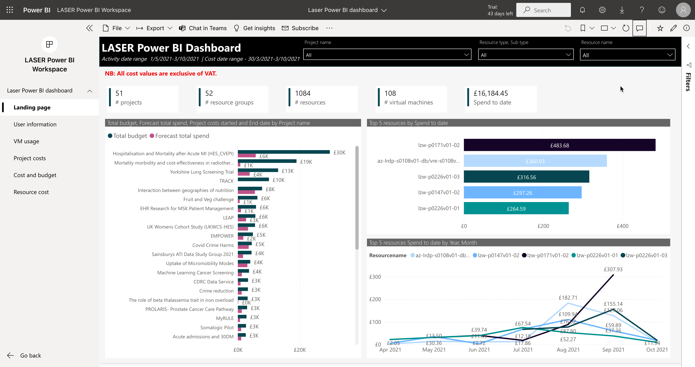
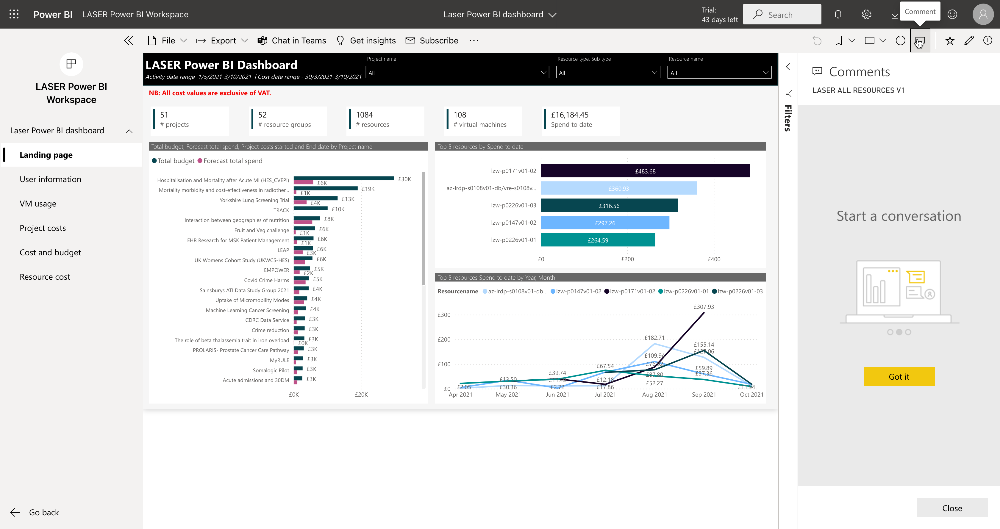
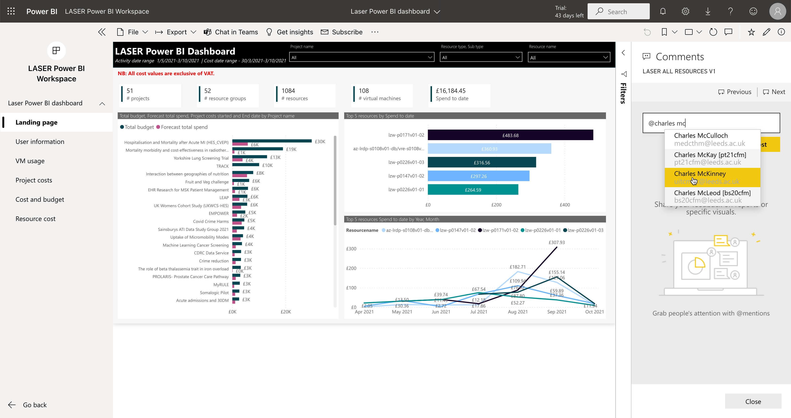
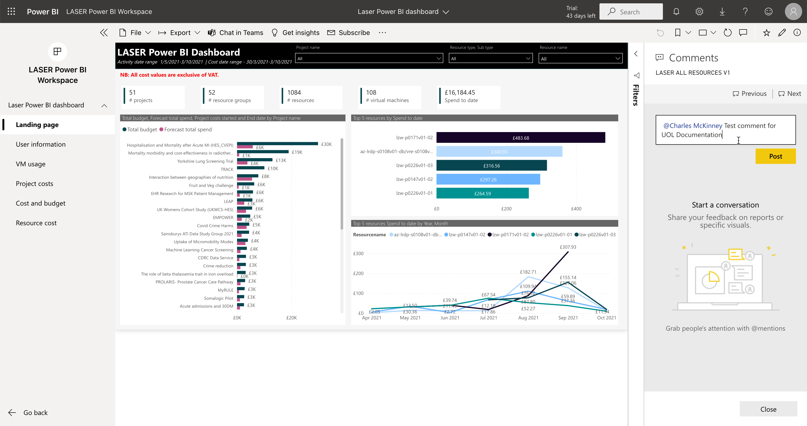
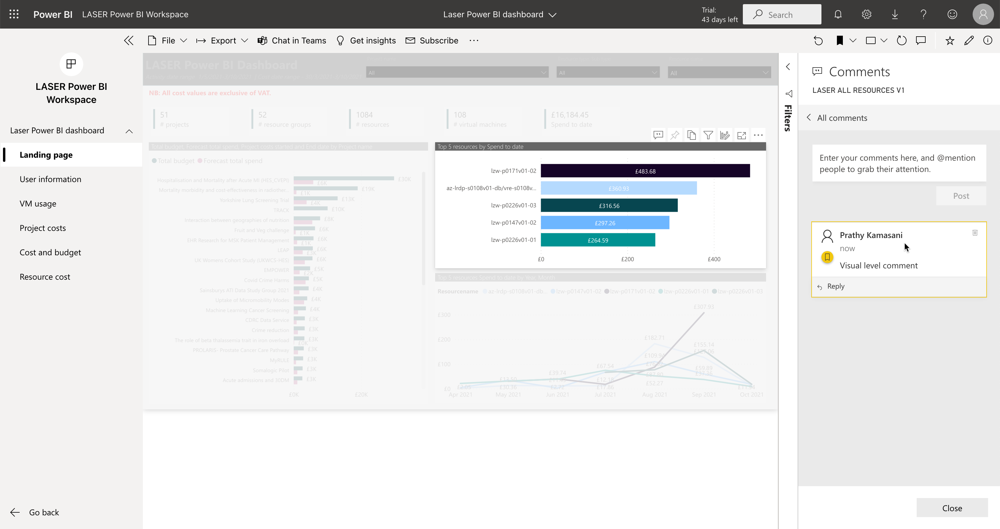
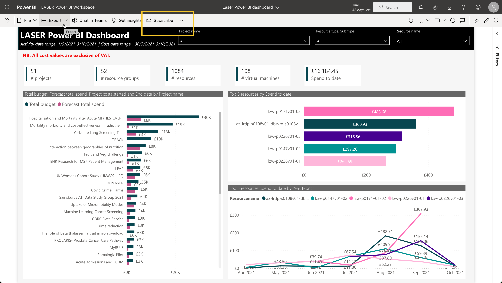
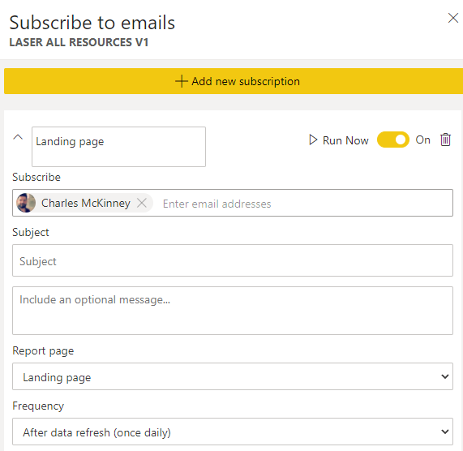

# Advanced Functionality
{:.no_toc}

* seed list
{:toc}

## Personalise a visual

A user can personalise any visual.

Hover over a visual to see the options then click on Personalize this visual. 

 
There are various options available. A user can change the report layout to display alternative visualisations and choose different columns.

A user can go back to default state by clicking [Reset to default](./navigation.html#reset-to-default).

## See what data is available in the model

The subtext of the report title shows the range of the data available in the Power BI Model. Activity data runs from 01/05/21 to the most recent synchronisation, and Cost data covers the full time span of the projects displayed up to the most recent synchronisation. 

These dates will alter depending on the selected project and their underlying data.

## Commentary 

### Comment at Report page level

Click on the Comment icon on the right hand size of the window.

Start typing in the window on the right. You can even tag other users. 

### Comment at visual level

Click on more options of the visual, then click Add a comment.

Now a comment is bound to a particular visual. 

## Subscribe to Reports

To receive notifications of the latest report data first of all click on Subscribe.

Click on Add new subscription, fill in the required details and select Frequency ‘After data refresh’.

A user can manage all subscriptions by going here - [https://app.powerbi.com/groups/me/settings/communications](https://app.powerbi.com/groups/me/settings/communications)
