# Slicers & Filters
{:.no_toc}

* seed list
{:toc}

## Working with Slicers

Slicers in Power BI are used for cross filtering data.

In this report all slicers by default cross filter the rest of the visuals. Every slicer has the functionality to search.  

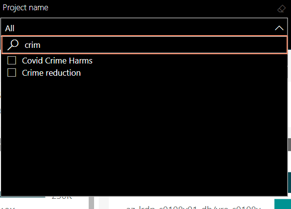

Clear the slicer by using the eraser option.  

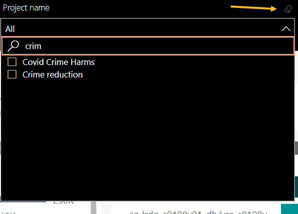

Single select on Slicer. Single mouse click selects one item.  

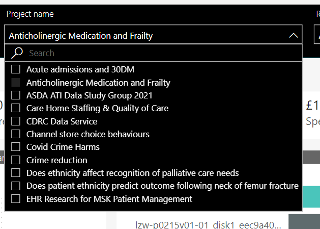

Multi select on slicers. CTRL + Click to multi select items.  

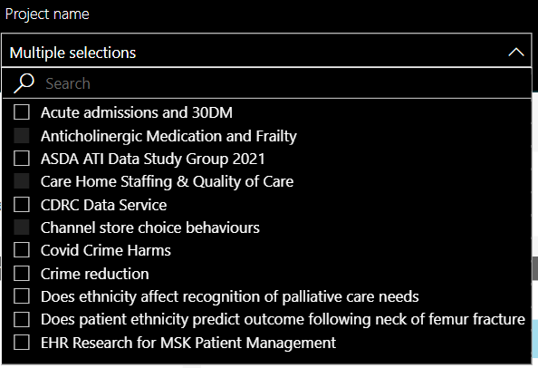

## How to use the Filters Pane

The Filters pane can be enabled by clicking on show or hide option on the right side of the report. Unless configured differently, all Power BI reports by default have the Filter pane available.

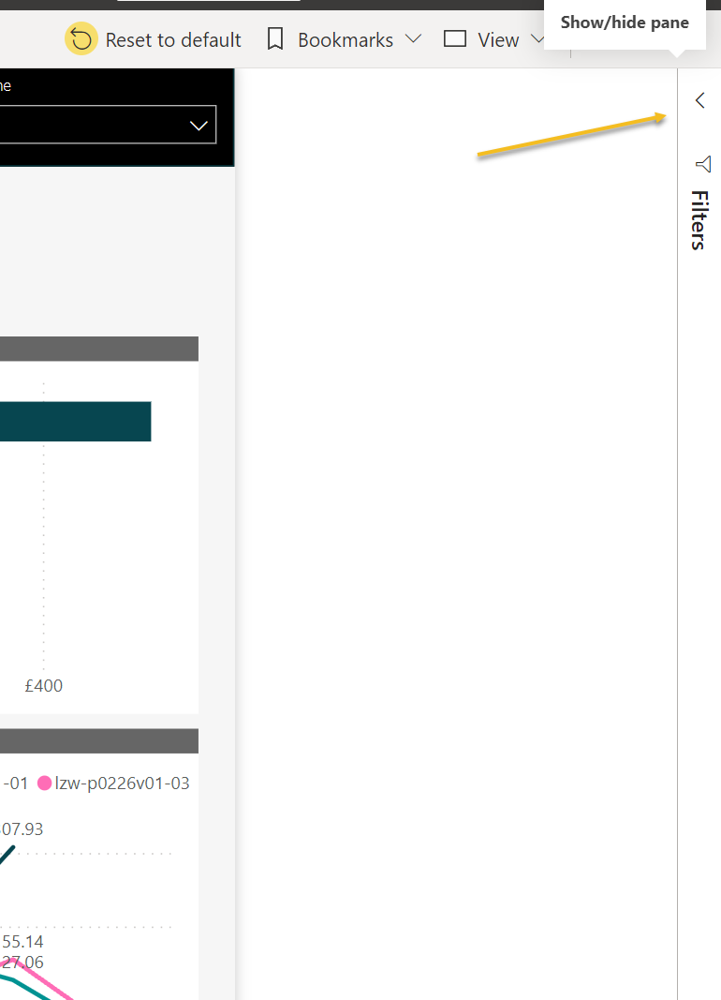

There are different types of filters available;
- Report Level Filters
- Page Level filters
- Visual Level Filters

In this Report, there are no report level filters applied. Page level filters are available for the Landing Page and User Information page. Visual level filters are available on the VM usage, Project costs, Cost and budget and Resource cost pages.

This is to allow you to filter the quantity of data displayed on a particular page. 

To enabled visual level filters you need to select a single visual. Page level filters are available automatically.

For example, when there is a use case where a user wants to see the Top 10 resources by cost rather than the default Top 5 resources. Then the user can Show Filters, click on a visual and then update the first element in the filter to be 10 instead of 5 and click ‘Apply filer’, see screenshots below.

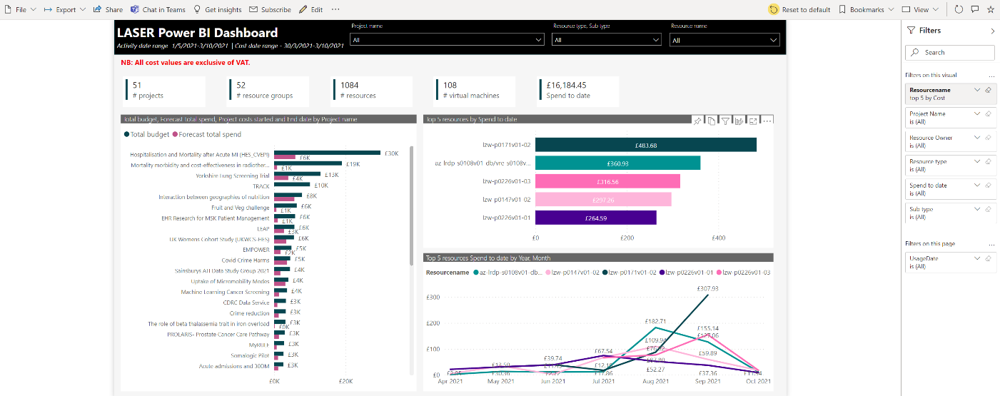
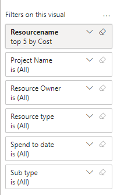
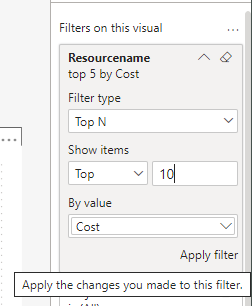

### Cross filtering in Power BI

By default Cross filtering is enabled for all visuals in Power BI. If you select a data point on one of the visuals, all of the other visuals on the page that contain that data change based on that selection.
[Understand how visuals interact in a report - Power BI | Microsoft Docs](https://docs.microsoft.com/en-us/power-bi/consumer/end-user-interactions)
For example, by default a page may look like below, displaying a number of projects a user may have access to.
 
When a specific project is selected, the rest of the visuals change to reflect that selection.

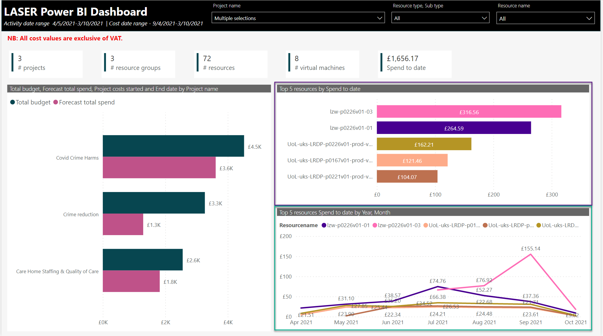

Now the visuals inside the yellow box and the key metrics above are cross filtered based on the selection.

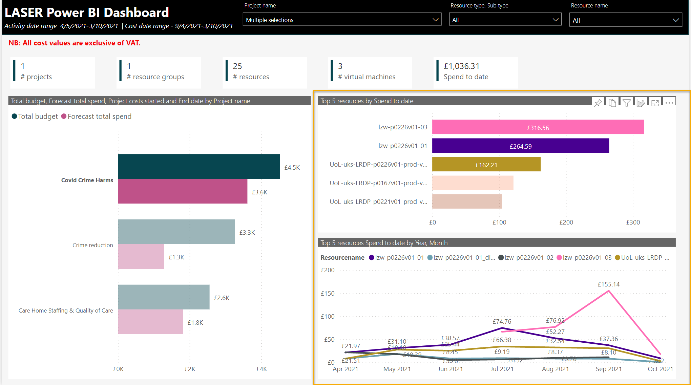

### How to view effecting filters and slicers on a particular visual

When hovering over visuals the Visual options are displayed. By clicking on the funnel button one can see which filters and slicers are applied to a particular visual. 

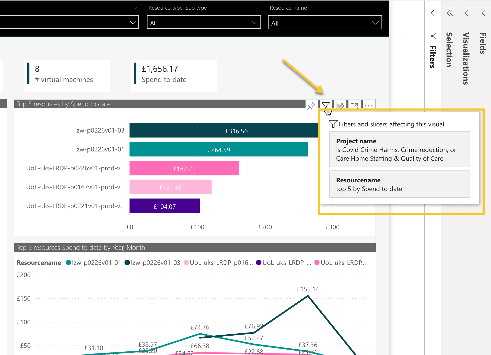

