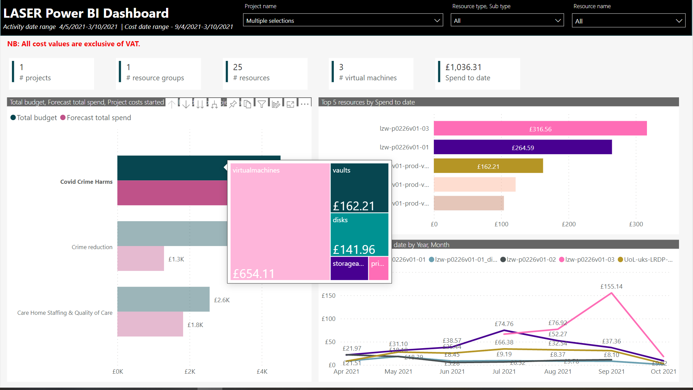

# Tool tips in Power BI 

We have Report Page tooltips and Default tooltips available in this report. Tooltips are extra information related to the selected visual.

Report page tool tip:

Default tooltip:

Default tooltips are available on all visuals and objects on the page, except where it is intentionally disabled. For example text labels may have tooltips disabled.

