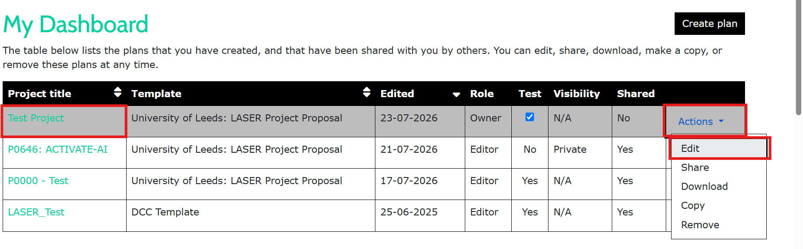

# Access and Edit an Existing LASER Project Proposal

**1. Open an existing proposal**: After signing in to DMPonline, you'll see a list of the project proposals you've created.  

To open a proposal, either:  
- Click the project proposal title, or  
- Select Actions → Edit.  

  

**2. Update your proposal**: Make any required changes to your proposal.
When you've finished, click **Save**.  

  

**3. Notify the team**: After saving your updates, email **dat@leeds.ac.uk** to let us know your proposal has been updated. We will then review the changes.  