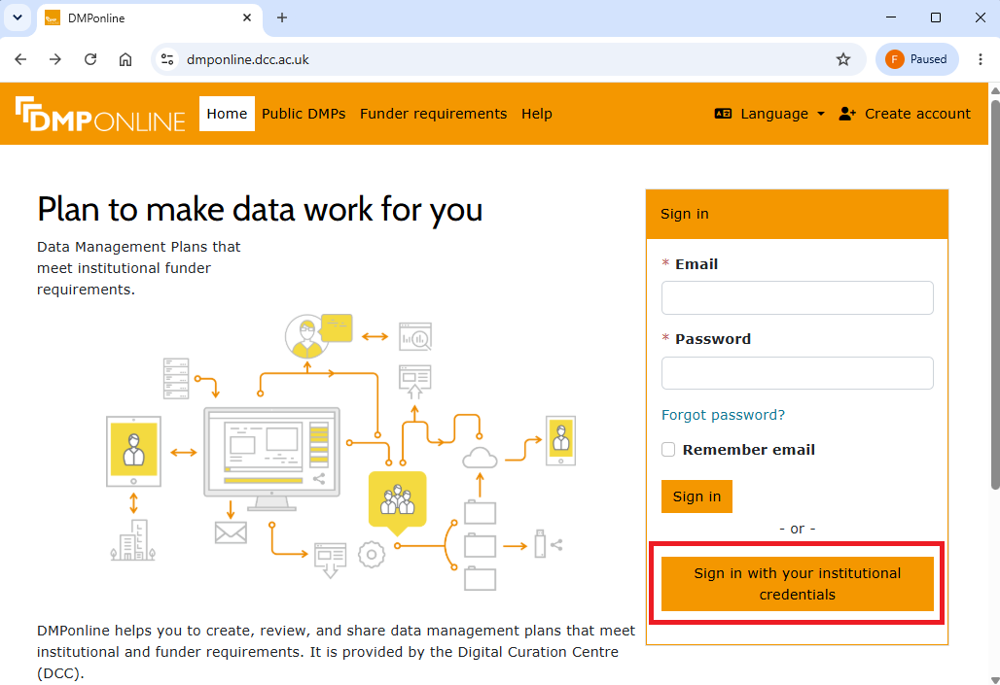
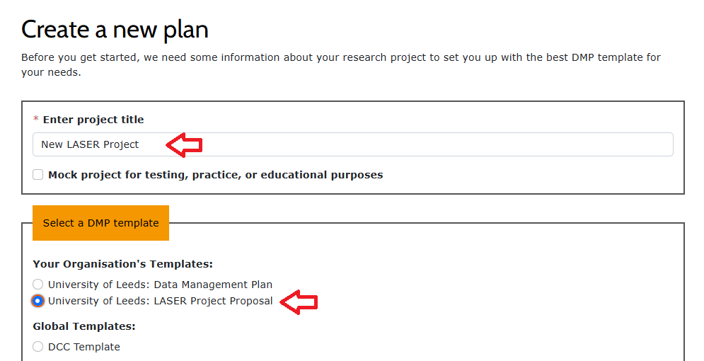
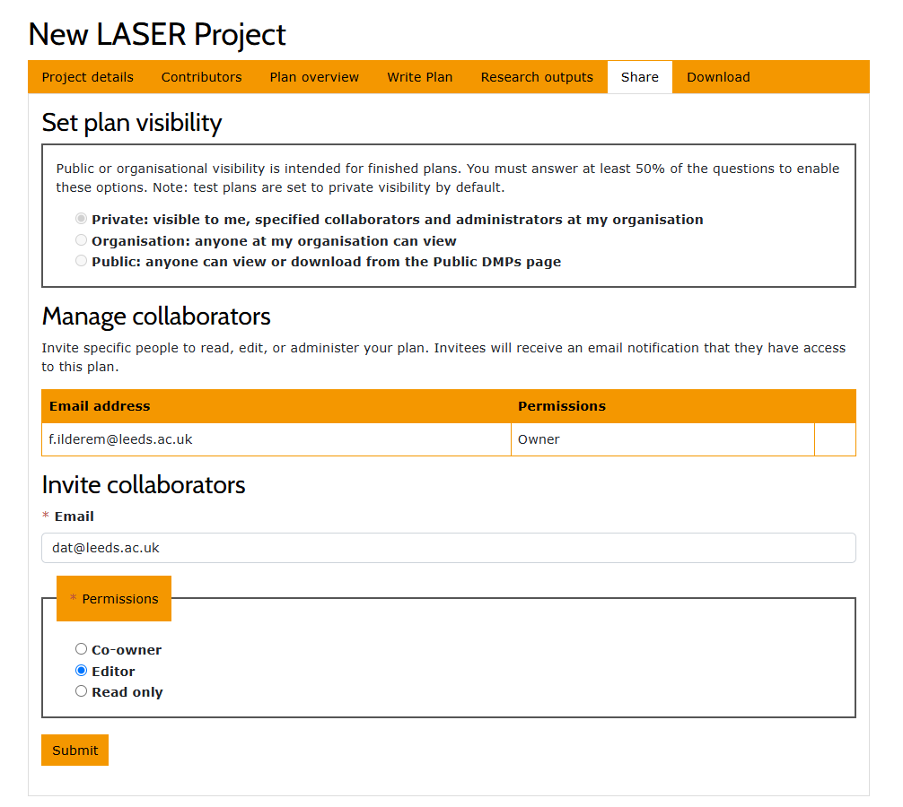

# Creating a LASER Project Proposal in DMPonline

This guide walks you through creating a new LASER Project Proposal using DMPonline, and sharing it with the LIDA Data Analytics Team.

**1. Sign in to DMPonline**: Go to [dmponline.leeds.ac.uk](https://dmponline.leeds.ac.uk/) and click **Sign in with your institutional credentials**.



**2. Select your organisation**: On the Discovery Service page, type **University of Leeds** into the search box, select it from the dropdown, and click **Continue**.
You'll be redirected to sign in with your usual University of Leeds credentials.

**3. Create a new plan**: Once signed in, click **Create plan** at the top right of the page.
Enter your project title, then under **Your Organisation's Templates**, select **University of Leeds: LASER Project Proposal**.



Scroll down and click **Create** at the bottom of the page.

**4. Start writing your plan**: Go to the **Project details** tab and add some general information about your project.

Then head to the **Write Plan** tab and provide more detailed information about your project proposal.

**5. Share your plan with the team**: Once your project proposal is complete, go to the **Share** tab. Under **Invite collaborators**, enter:

```
dat@leeds.ac.uk
```

Set the permission to **Editor**, then click **Submit**. This makes your plan visible to the Data Analytics Team.



Once you've submitted, please email **dat@leeds.ac.uk** to let us know your proposal is complete, so we can review it.