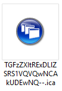
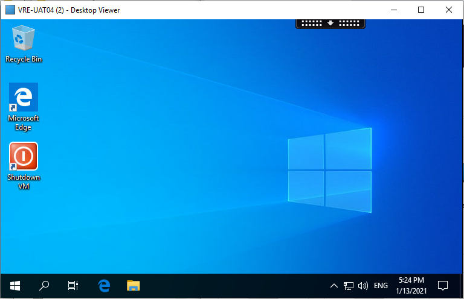

# Connect to a Virtual Research Environment
{:.no_toc}

* seed list
{:toc}

 


## Prerequisites
You will need:
- Citrix Workspace installed to the machine you are connecting to LASER from.
  - On University managed devices you may need to make a request with IT Services
  - On personal devices you can download and install the latest Citrix Workspace from [here](https://www.citrix.com/en-gb/products/receiver.html)
- Duo two factor authentication enabled.
  - More information on DUO can be found [here](https://it.leeds.ac.uk/it?id=kb_article&sysparm_article=KB0014537).

## Log in to the Storefront
- Navigate to the StoreFront here: [https://laser.leeds.ac.uk/](https://laser.leeds.ac.uk/).
- Sign in using your University of Leeds credentials.
- When prompted, choose an authentication method and accept the login request/enter the passcode.  

- You may be asked if Citrix Receiver is installed:
  - Click to detect installation.
  - Allow browser to 'Open Citrix Workspace Launcher'.
  - If not detected but installation is present click 'Already installed'.
- You are now presented with all of the VRE desktops you have access to. Each icon represents a different virtual machine, and one VRE can have many.
- Click on the image of the monitor or expand the options and click 'Open' to connect. 
**Note that any failed attempt to open the chosen virtual machine will still cause it to start running in Azure and therefore incur costs. [Virtual machines can be stopped without logging in](./az_portal/portal_vms.html), via the Azure Portal, if needed.** 

  - You may be asked to download a *.ica launcher file.  
  
  - Save and open this file, it will be deleted when your session ends.
- Citrix Workspace will launch and connect to your chosen virtual machine
- You will  need to acknowledge the University of Leeds Legal Notice to continue. 
	- Failure to do so within 3 minutes will automatically disconnect the session, leaving the virtual machine running and incurring costs.
	- If this happens you can simply attempt to reopen the same virtual machine. It should open much more quickly as it is now in a 'Running' state.

- On clicking OK to the Legal Notice you will be presented with tour VRE desktop.  

