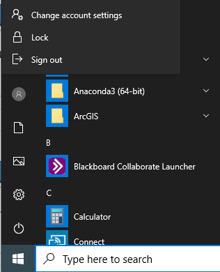
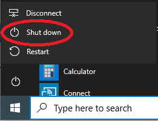
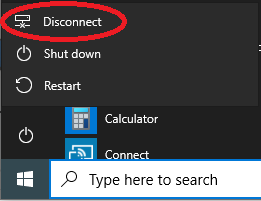
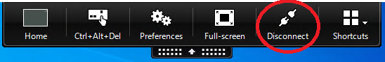

## Closing a Virtual Research Environment  
There are three ways to close a VRE and each has significant differences regarding cost and continual processing:
- Log off
- Shut down
- Disconnect

The below table summarises the main differences, but the most significant is that **costs continue to accrue when shut down or disconnected** but not when logged off. 

We recommend logging off whenever you finish a session. Disconnecting from a session should _only_ be used if you need to walk away from the session but still want code to run while you are away. A disconnected session will continue to accrue costs even if code has completed running.

|Log off |Shut down |Disconnect |
|---|---|---|
|Stops accruing costs after 1 minute|Costs continue to accrue|Costs continue to accrue|
|Terminates session|Terminates session|Keeps session running|
|Processes stop|Processes stop|Processes can continue|
|Other users can now log in to this VM|Other users can now log in to this VM|No other users can log in to this VM|

### How to Log off 
Click Start button --> Profile --> Sign out  

### How to Shut down
Click Start button --> Power --> Shut down  

### How to Disconnect
You can disconnect several ways, but only should if you want code to continue to run in your absence. **Costs will continue to accrue** and VM will be locked for use by other users **until you reconnect then log off or shut down**.  
- Start button --> Power --> Disconnect  

	
	
- Expand the Citrix menu at the top of the screen --> Disconnect  

	
	
- X-ing out of the VRE window  

	
