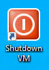

## Closing a Virtual Research Environment  
There are three ways to close a VRE and each has significant differences regarding cost and continual processing:
- Shutdown
- Sign out
- Disconnect

The below table summarises the main differences, but the most significant is that **costs continue to accrue when a user disconnects** but not when they shutdown or sign out. 

We recommend using the big red button to shutdown or signing out whenever you finish a session; both are functionally identical. Disconnecting from a session should _only_ be used if you need to walk away from the session but still want code to run while you are away. A disconnected session will continue to accrue costs even if code has completed running.

VMs can also be [stopped from the Azure Portal](https://lida-data-analytics-team.github.io/laserdocs/docs/laser_how_to/az_portal/portal_vms.html#stopping-a-vm), but doing so will kick out anyone currently connected and may result in lost work.

|Shutdown |Sign out |Disconnect |
|---|---|---|
|Stops accruing costs after 10 minutes|Stops accruing costs after 10 minutes|Costs continue to accrue |
|Terminates session|Terminates session|Keeps session running |
|Processes stop|Processes stop|Processes can continue |
|Other users can now log in to this VM|Other users can now log in to this VM|No other users can log in to this VM |

### How to Shutdown
Click the big red icon on the desktop and choose yes on the dialog:  

  

  

### How to Sign out 
Click Start button --> Profile --> Sign out  

### How to Disconnect
You can disconnect two ways, but only should if you want code to continue to run in your absence. **Costs will continue to accrue** and VM will be locked for use by other users **until you reconnect then sign out or shutdown**.  
	
- Expand the Citrix menu at the top of the screen --> Disconnect  

	
	
- X-ing out of the VRE window  

	
