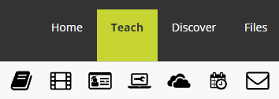
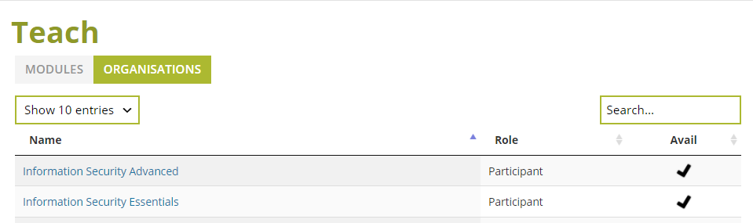

## Where to find Minerva Training

Before access can be granted to LASER all users are required to demonstrate that they have taken and passed a minimum training standard. Additional training may be required depending on data risk classification and/or data sharing requirements.

Currently the minimum requirement is for all users to have taken the Information Security Essentials (within the last 12 months) and Information Security Advanced (within the last 24 months) online training modules available through Minerva.

Minerva can be accessed at the following link: [https://minerva.leeds.ac.uk/](https://minerva.leeds.ac.uk/)

Once logged in using your University of Leeds credentials you should find the modules listed under Teach --> Organisations.

Click on a training module to open it up and begin. 

Once you have passed the test at the end of the training please send screen shots of your passing scores to the DAT at [ircdst@leeds.ac.uk](mailto:ircdst@leeds.ac.uk).