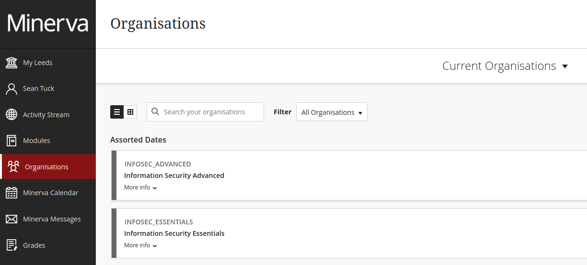

# Where to find Minerva Training

Before access can be granted to LASER all users are required to demonstrate that they have taken and passed a minimum training standard. Additional training may be required depending on data risk classification and/or data sharing requirements.

To access LASER, users must have completed the Information Security Essentials training in the last 12 months and the Information Security Advanced training in the last 36 months. Both training modules are available on Minerva.

Minerva can be accessed at the following link: [https://minerva.leeds.ac.uk/](https://minerva.leeds.ac.uk/)

Once logged in using your University of Leeds credentials you should find the modules on the Organisations page:

{:width="100%" .mx-auto}

Select a training module to open it and begin. 

Once you have passed the test at the end of both modules, take screenshots of the completion pages, each showing the completion date and pass grade, and send the screenshots to the DAT at [dat@leeds.ac.uk](mailto:dat@leeds.ac.uk). 

If any of the training modules are not listed please contact IT Services to ask them to make the training available to you. 
