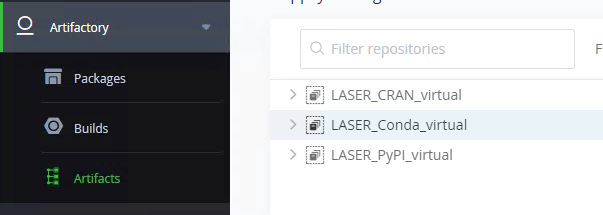
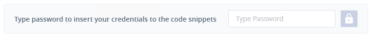
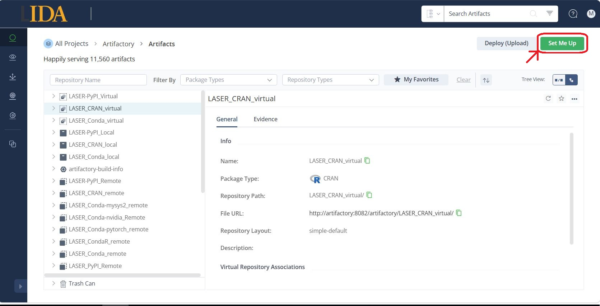
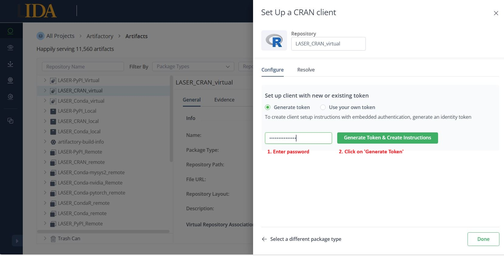
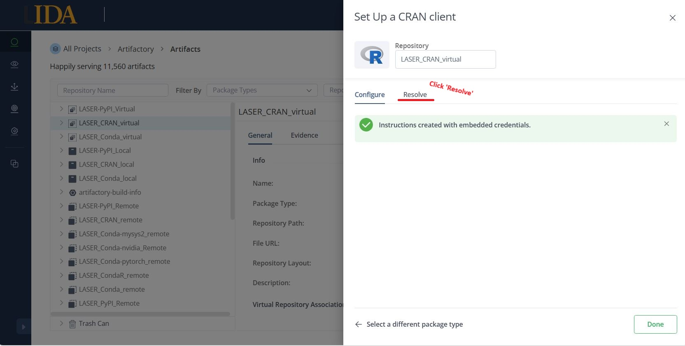
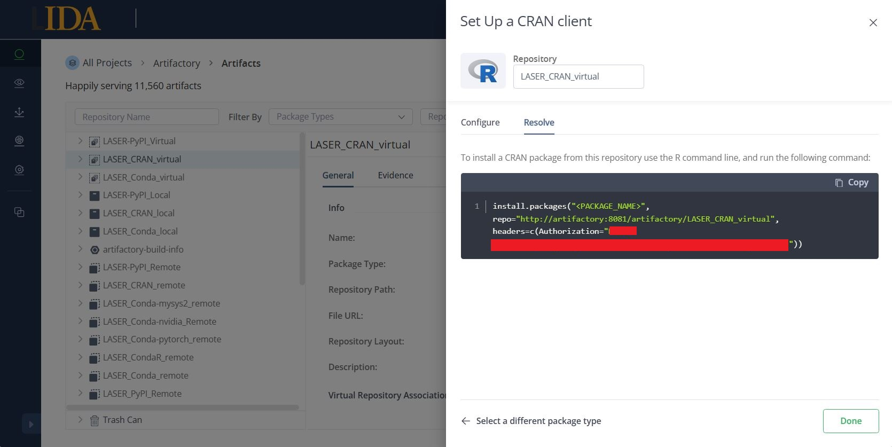

# Artifactory 
{: .no_toc }

LASER now has a means to provide air-gapped access to online package repositories that you can use from within your offline VRE. We are currently able to provide access to CRAN, Conda and PyPI repositories. Here you will find everything you need to know to gain access to them. These are one-time configuration steps that will persist between sessions, but will need to be repeated for each VM you log in to within your VRE.

## Setting up artifactory 
{: .no_toc }

The following 6 steps are common across the configuration of each artifactory mirror. If you change your Windows password you will need to configure each of the artifactory repos once more.

1. From a web browser within your VRE navigate to **http://artifactory:8082**.
2. Log in using your UoL credentials.
3. In the left-hand menu click Artifactory --> Artifacts.  
	
4. Choose a **virtual** mirror
	- LASER_CRAN_virtual 
	- LASER_Conda_virtual 
	- LASER_PyPI_virtual 
5. At the top right of the screen click on 'Set me up'.  
	
6. Enter your UoL password to hash and insert your credentials into the generated code snippet.  
	

Now continue to follow the package repository specific instructions below:
- TOC
{:toc}


### CRAN
1. From the Artifacts page select the 'LASER_CRAN_virtual' Repository.


2. Click 'Set Me Up' in the top right corner.



3.  On the 'Configure' tab, select 'Generate Token'. Enter your password and click 'Generate Token & Create Instructions'



4. You should see a message that reads 'Instructions created with embedded credentials. Now click on the 'Resolve' tab.


5. On the resolve tab you will see the intructions with embedded credentials.



To install packages you can paste the instructions directly into R:

```R
install.packages("<PACKAGE_NAME>", repo="http://artifactory:8081/artifactory/LASER_CRAN_virtual", headers=c(Authorization="<Your authorisation key>"))
```
Or to install multiple packages:

```R
install.packages("<PACKAGE_NAME>", "<PACKAGE_NAME_2>", "<PACKAGE_NAME_3>" repo="http://artifactory:8081/artifactory/LASER_CRAN_virtual", headers=c(Authorization="<Your authorisation key>"))
```


### Conda 

 

**NOTE:** ***Please install Miniconda (rather than Anaconda) from the Software Centre***

Select LASER_Conda_virtual in step 4 above.

The code snippet will be generated directly below the password field in the 'Configure' tab.

Open anaconda python and run the below command to generate .condarc file.

```python
conda config
```

Find the .condarc file in `C:\Users\<USERNAME>\`, open in Notepad and replace contents with the code snippet generated by Artifactory.

For Miniconda, you will need to create a new environment to install packages.  We recommend creating the new environment within the shared project drive (N: drive)

```python
conda create --prefix N:\_python_envs\<name_of_your_env>\
conda activate N:\_python_envs\<name_of_your_env>\
conda install <your-package-name>
```
Replace <name_of_your_env> with the name you want to use for your new environment.

Please note, even after setting the TRE to use Artifactory for conda it's still not possible to clone your base environment.

### PyPI

 

**NOTE:** ***Please install Miniconda (rather than Anaconda) from the Software Centre***

Select LASER_PyPI_virtual in step 4 above.

The code snippet will be generated in the 'Resolve' tab.

Replace the contents of the `C:\Users\<USERNAME>\pip\pip.ini` file with the code snippet containing your hashed credentials. 
- Artifactory may tell you to replace the contents of `pip.conf`, but `pip.ini` is the Windows equivalent.
- You may have to manually create `...\pip\pip.ini` if it doesn't already exist.  

Append the following to pip.ini:
```ini
trusted-host = artifactory
```

The full contents of pip.ini should look something like this (please ensure to include a trailing line break):
```ini
[global]
index-url = http://<USERNAME>:<PASSWORD>@artifactory:8081/artifactory/api/pypi/LASER_PyPT_virtual/simple
trusted-host = artifactory

```

You can now install packages using
```python
pip install <PACKAGE>
```
