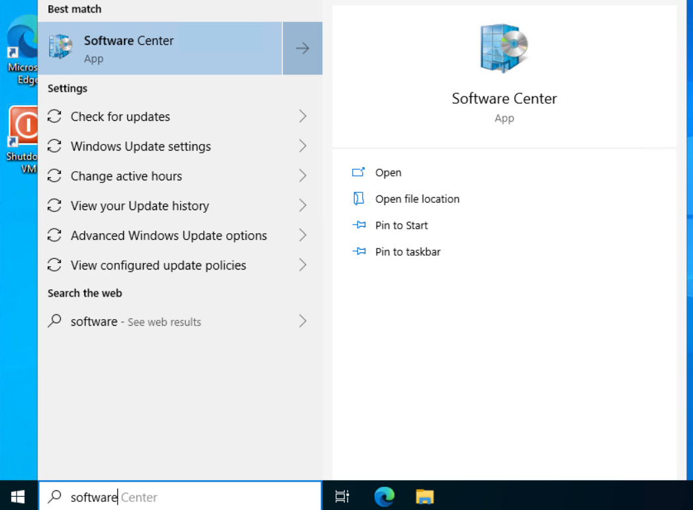
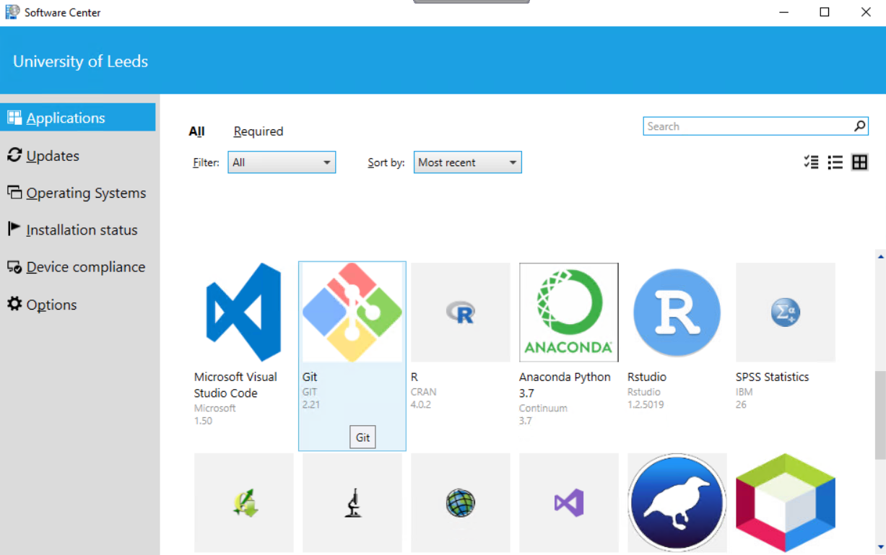
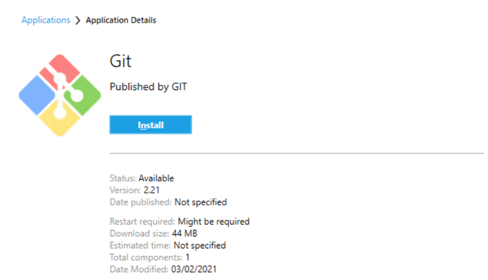

# Install Software via Software Center

Optional software in LASER VREs are provided via Software Center. If your VRE doesn't include software that you need, first check it can be installed in Software Center.

Open Software Center by typing its name in the taskbar search and selecting it from the results.

{: .mx-auto }

In Software Center, you'll see a grid of icons for all the software that can be installed. Each grid item shows the software version. Multiple versions of a software may be provided. Find the software you want to install and select it.

{: .mx-auto }

You'll then see details about the software, including the build status, download size and more. Select the Install button to install the software.

{: .mx-auto }

The status shown will change to "Installing". If it's a large installation, you may see the estimated time remaining for the installation to complete.

Once the installation is complete, the status will change to "Installed". Where previously there was an Install button will now be an Uninstall button.

You should now be able to find the installed software by looking in your Start menu or searching in the taskbar.

You can install multiple versions of software at the same time, for example, multiple versions of R are available in Software Center.

Software are installed to the Virtual Machine (VM) you're using, in the `C:\` drive. If any other users also have access to this VM, they'll see the installed software too. If you open a different VM in the same Virtual Research Environment (VRE), you won't find the software unless you also install it there. Equally, any configurations made to installed software will be specific to VMs, not VREs. For more details on LASER's VRE architecture, see '[What is LASER?](../../laser_info/laser.html)'.

If you need to install software that you can't find in Software Center, contact the [LIDA Data Analytics Team (DAT)](mailto:dat@leeds.ac.uk) to make a software request. Your request will then be reviewed and added to the pipeline of new software. You should also speak with the DAT team if your installed software is not working properly.
