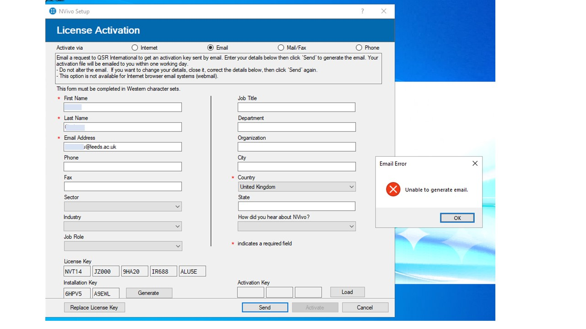

# How to Activate Nvivo Offline

To use Nvivo on a LASER VM, follow these steps to install and activate the license offline.

- Install Nvivo from Software Centre
- Open Nvivo after installation; it will prompt you to enter your activation license and some of your details. The current license can be found on the [IT services website](https://it.leeds.ac.uk/it?id=kb_article&sysparm_article=KB0015763).
- Display the Activation screen. If not already displayed, go to File > Help > Manage License > Activate License (or select Activate Now on the Activation Reminder).
- Click Activate via Email or Mail/Fax. If you are unable to select these options, try activating the license and wait for the error message to be displayed. Once the activation has failed, you should see the Email or Mail/Fax options.
- Enter your details. Those marked with an asterisk (\*) are required - First Name, Last, Email, and Country.
- Click the Generate button to refresh the Installation Key.
  If activating by Email, click the Send button. NVivo will generate an activation request email using your default mail client. You can also take a screenshot of the completed Activate screen, save it, and send it to Lumivero Support: NVivo Support <support@qsrinternational.com> asking them to help you activate Nvivo offline. You may ask DAT to ecport the image for you if neccessary. 

**Nvivo Support will respond and send you a .JSON file. Follow this guide to complete the offline activation using the JSON file.**

- Save the attached .JSON file to your computer. (Ask DAT to import the JSON file for you)
- Open NVivo and try to activate again with your license key, entering your details as they were in the previous form. When the activation fails, select to activate via Email/Fax.
- On the activation screen click Load, browse to the location you saved the .json file and select it. Click OK.
- Click Activate to complete activation.

Direct any questions or concerns to DAT<dat@leeds.ac.uk>.

