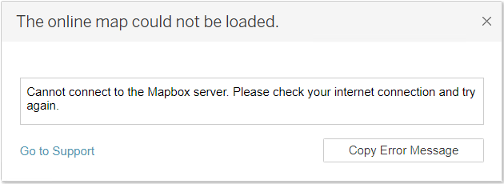
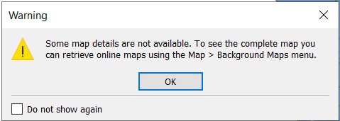

# Using Tableau in LASER

## Licence & activation

Tableau can be installed via [Software Centre](./index.html) in a LASER virtual machine (VM). However, an unlicensed version will be installed as we are currently unable to provide a licensed version to everyone. Tableau offer a free 14 day trial, but for prolonged access you'll need to acquire a Tableau licence and activate it inside your LASER VM. Note that the licence is specific to a VM so may not be used to activate Tableau in every VM in your Virtual Research Environment (VRE).

The [VREs](../../laser_info/laser.html) are offline environments. Using Tableau offline means that your must perform product activation using an offline process, and that you use offline maps for the visualizations that require them.

See Tableau Desktop's Deployment Guide for instructions on [how to activate Tableau offline](https://help.tableau.com/current/desktopdeploy/en-us/desktop_deploy_activate_license.htm#offline). This involves exporting an activation request file from LASER, created using your licence key; then uploading this file to Tableau's website, outside of LASER, to create an activation verification file; then importing this verification file into LASER to confirm the offline activation.

**IMPORTANT**: Tableau advises [deactivating a licence before uninstalling Tableau](https://help.tableau.com/current/desktopdeploy/en-us/desktop_deploy_move_or_deactivate.htm) to ensure the same licence can be used on another computer.

## Maps

By default Tableau is configured to download map information dynamically from the Internet, which in LASER produces errors like:

{:width="70%" .mx-auto}

{:width="70%" .mx-auto}

You can prevent that error by selecting Map -> Background Maps -> Offline (and selecting that as the default).

It is possible to store map data for use offline with Tableau. See Tableau's guides on [selecting background maps](https://help.tableau.com/current/pro/desktop/en-us/maps_mapsources.htm) and [storing maps offline](https://help.tableau.com/current/pro/desktop/en-us/maps_offline.htm).
