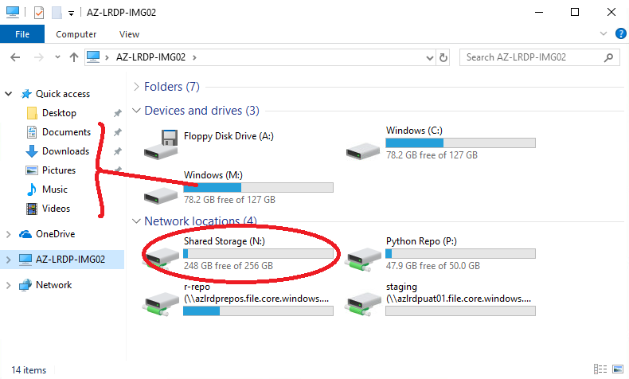

# Where is my project data?

In your virtual machine (VM), open up File Explorer and click on the computer name on the left, to see a list of drives (C:, M: etc.)

Your shared project storage can be found on the N: drive, as highlighted in the image below.

N: drive is shared across all VMs in your VRE.

We recommend saving all of your documents to the N: drive so that they benefit from the higher level backup schedule and remain available to the rest of your team. 

Permissions to the N: drive will be set up according to your project requirements; the default position is that all project members have read/write access to all areas of the N: drive.

Please note that file deletions are permanent. There is no 'Recycle Bin'.

## Other drives 
The C: drive is the operating system storage and does not benefit from the same backup retention schedule as project storage. Please refrain from saving any files here.

M: drive contains the user directories that contain the default _'Quick access'_ folders. It is similarly existant on the virtual machine only and we recommend that you **avoid using M: (incl. Documents, Downloads, etc.)**.  
Files saved to user directories on M: (Documents, Downloads etc.) will not be available across the VRE, only on the VM you are currently connected to. They also do not benefit from the same backup retention schedule as project storage on N: drive.

R: and P: drives relate to package repositories that you will only have read access to.

'staging' is used for data transfers to and from the VRE.
