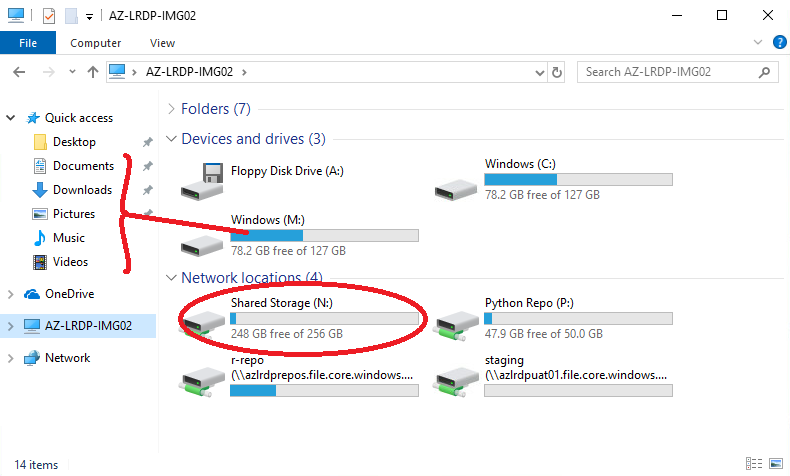

# Where is my project data?

In your virtual machine (VM), open up File Explorer and click on the computer name on the left, to see a list of drives (C:, M: etc.)

Your shared project storage can be found on the N: drive, as highlighted in the image below.

N: drive is shared across all VMs in your VRE.

We recommend saving all of your documents to the N: drive so that they benefit from the higher level backup schedule and remain available to the rest of your team. 

Permissions to the N: drive will be set up according to your project requirements; the default position is that all project members have read/write access to all areas of the N: drive.

Please note that file deletions are permanent. There is no 'Recycle Bin'.

## Restrict access to a folder on the N: drive

Occasionally projects need to restrict sections of their VRE to specific people. For example to limit access to data according to the terms of a contract. If you need to do this, submit a request to the Data Analytics team at [dat@leeds.ac.uk](mailto:dat@leeds.ac.uk).

In your request, describe:

- The name of the folder you want created that will contain restricted access files
- The level of read/write permissions those granted access should have, e.g. read-only or modify
- List the individuals who should be granted access to this restricted folder
- Describe what files will be stored in the restricted folder
- Your project's Data Management Plan will need updating to include the above details, so you may want to attach an updated version to your request

The Data Analytics Team will then complete this request.

## Other drives 
The C: drive is the operating system storage and does not benefit from the same backup retention schedule as project storage. Please refrain from saving any files here.

The M: drive contains the user directories, which include the default _'Quick access'_ folders. It similarly exists only on the virtual machine, and we recommend that you **avoid using M: (including Documents, Downloads, etc.)**.  
Files saved to user directories on the M: drive (Documents, Downloads, etc.) will not be available across the VRE, only on the VM you are currently connected to. They also do not benefit from the same backup retention schedule as project storage on the N: drive.

R: and P: drives relate to package repositories that you will only have read access to.

'staging' is used for data transfers to and from the VRE.
