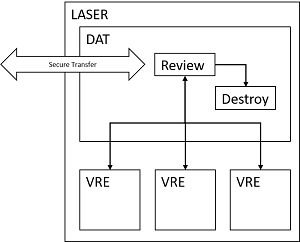

# How to import or export files from LASER
{:.no_toc}

All transfers to & from LASER are processed by the Data Analytics Team who will perform a disclosure and compliance review before any files are moved. Files that fail review will be rejected for transfer and reported to **Governance, Risk & Compliance**.  

For data that have been [classified](../laser_info/tiering.md) as Tier 3 sensitivity and above a secure transfer mechanism must be used, ie not email attachments or DropBox etc.  

LASER's Secure File Transfer platform, [Biscom SFT](https://laser-sft.leeds.ac.uk/sft), is the primary means of file transfer in and out of LASER. Other mechanisms for transfer are possible where appropriate.  

Only organisational email accounts can be used for transfers to and from LASER, and exports must be to named individuals.  

* seed list  
{:toc}

## Import

The DAT can facilitate transfers of code & data files from third parties and project members directly to the LASER environment.  

To initiate a file import, send an email to the DAT group inbox [dat@leeds.ac.uk](mailto:dat@leeds.ac.uk) making sure to include the following details:
- the name and/or number of the destination VRE 
- the name and email address of the data sender or the location of the files to be imported

It will speed your request to include additional information in order to help us ascertain compliance with applicable contracts and agreements:  
- What does each file contain?  
- What data, if any, is contained within each file?  
- From where was it sourced?  
- What risk classification is this data?  
- Has this been captured by the data management plan?  

The DAT will then arrange with the data sender to facilitate the transfer, most commonly by inviting them to use the LASER SFT. The sender will receive an automated notification inviting them to register use the platform. Once registered and logged in they will see a message from a member of the DAT. Attaching files to a reply to that message will send them directly to us in LASER.  

## Export

The DAT can facilitate transfers of code & data files to third parties and project members directly from the LASER environment.  

To initiate a file export, send an email to the DAT group inbox [dat@leeds.ac.uk](mailto:dat@leeds.ac.uk) making sure to include the following details:
- the name and email address of the data recipient
- the name and/or number of the source VRE 
- the name and location of the file within the VRE

It will speed your request to include additional information in order to help us ascertain compliance with applicable contracts and agreements:  
   - What does each file contain?  
   - What is the source data for each file?  
   - How was each file generated?  
   - What measures have been taken to minimise disclosure risk?  

The DAT will then arrange with the data recipient to facilitate the transfer, most commonly by inviting them to use the LASER SFT. The recipient will receive an automated notification inviting them to register use the platform. Once registered and logged in they will see a message from a member of the DAT and their file(s) available for download.  
