# Troubleshooting
{:.no_toc}

Here are the answers to some common issues. If you have a problem not covered here please get in touch with the Data Analytics Team at [dat@leeds.ac.uk](mailto:dat@leeds.ac.uk).

* seed list
{:toc}

## My VRE won't start: Cannot start desktop

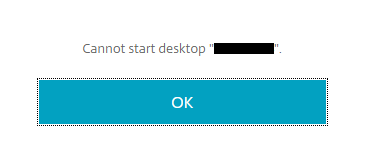

If you see the error message "Cannot start desktop" then chances are good that another member of your team is currently logged in to that specific virtual machine. Try another VM if there is one available within the VRE, or check that no-one else is currently logged in.

A VM will remain 'occupied' even if the user has disconnected. 

Simply closing the window ('Xing out') will disconnect the user from the session. When disconnected the session remains active and running; users will need to log off or shut down to vacate the machine so that someone else can log on.

## My VRE won't start: Failed with status 1030

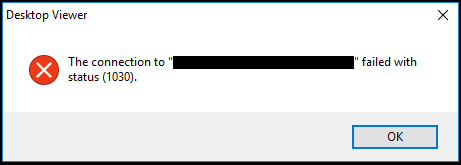

If the VRE looks about to open in a new window but then it crashes and you see the error message "The connection failed with status (1030)", this most likely means you will need to update the Citrix client on your device to the latest version of Citrix Workspace. IT Services will be able to assist with this if you do not have the necessary permissions on your device. Before updating Citrix you might try resetting Citrix by right-clicking the Citrix icon in your system tray > Advanced Preferences > Reset Citrix Workspace. If this doesn't resolve the 1030 error, or you can't find the Advanced Preferences, submit a request to have Citrix updated.

## The laser.leeds.ac.uk website fails to load 

If you receive the below error when trying to connect to [https://laser.leeds.ac.uk](https://laser.leeds.ac.uk) please check to make sure you are not logged on to the University of Leeds VPN. If you are connected to the VPN then you will not be able to connect to [https://laser.leeds.ac.uk](https://laser.leeds.ac.uk).

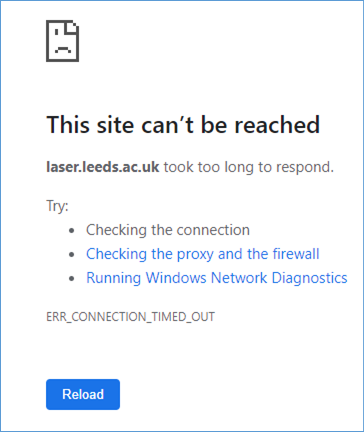{:width="60%" .mx-auto}

## LASER login failure: You cannot log on using a smart card

If you try to login to LASER after having timed out from a previous session, you may see the following message:

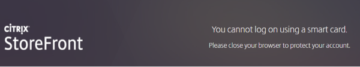

You can fix this by clearing browsing data up to and including the time since your last LASER login. Alternatively, avoid the error by opening a private/incognito window instead.

## The VRE hangs on 'Connecting...' and closes

When you first click on the VM in the storefront and you get the wheel spinning around, this has sent a command to Azure to power up the VM. Once the VM is powered up in Azure and available, the .ica file is downloaded in your browser.

The .ica file, this file contains config and connection information for Citrix workspace application to make a connection to the VM. Once a connection has been made, then VM window then logs your in and displays the legal notice which users have to accept.

If your failed session sat on the connecting screen that tells us that the Citrix application on your computer could not make a connection to the VM. This could be any number of reasons. A weak internet connection would cause this, issues with the Citrix workspace application on your computer, or in fact any range of issues on your computer that would result in a connection not being able to be made.

After confirming you have a strong internet connection please contact a member of the [DAT](mailto:dat@leeds.ac.uk) who will assist.

## Access LASER VRE on Linux machine

The steps below have been tested using Ubuntu OS and Firefox browser.

- Ensure versions of Ubuntu, Firefox and Citrix Workspace are up to date
- If you don't have Citrix Workspace:
    - Open the Citrix Workspace for Linux [download page](https://www.citrix.com/en-gb/downloads/workspace-app/linux/) and go to the latest version
    - Scroll to Available Downloads > Debian Packages > Full Packages (Self-Service Support) > Citrix Workspace app for Linux (x86_64)
    - Download and run the .deb file (if you're not running Ubuntu, you may need a different file)
- Go to https://laser.leeds.ac.uk and login.
- Select Detect Receiver
- Check box to always open receiver links: 
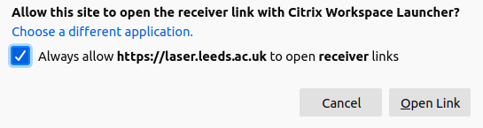{:width="70%" .mx-auto}
- Select Already installed
- Open VRE from Storefront. It will download an ica file.
- In dialog box on what to do with ica file, tell Firefox to always open with Citrix Workspace. Select OK: 
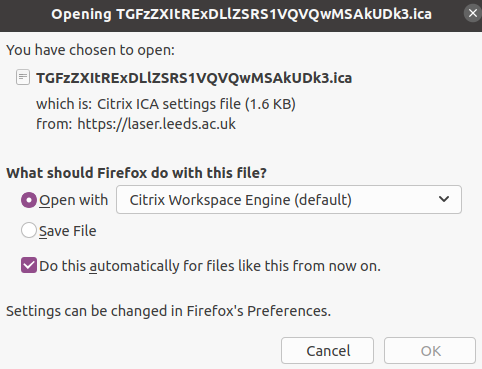{:width="70%" .mx-auto}
- The VRE will then open. In future, your browser will know to automatically open the VRE when an .ica gets downloaded.
- If you get an SSL Error 61 preventing you from opening your VRE:
    - Open Terminal
    - Run `sudo ln -s /usr/share/ca-certificates/mozilla/* /opt/Citrix/ICAClient/keystore/cacerts`
    - Type your password to authenticate (note that this requires admin rights)
    - Close Terminal window then retry LASER VRE login

## My session has timed out, how do I press CTRL+ALT+DEL to unlock?

VREs lock after a period of inactivity for security purposes. At the top of the window for your VRE desktop you should see a small black bar. Click the bar to expand a menu that includes a CTRL+ALT+DEL option. Click this option, select the password field that appears and input your password to unlock the session.

## App windows in my VRE are white and borderless, which are difficult to distinguish when they overlap

You can change the display settings and themes in your VRE's desktop. To display app windows with clearer boundaries, go to Settings by typing settings in the taskbar search. Go to the Personalization section and select the Colors tab. Scroll to the bottom of the page to find a checkbox called "Title bars and window borders". Check this box and to fill the title bars and borders of app windows with the accent colour selected in the colour block. You can choose a different accent colour if you wish.

## Anaconda Navigator is slow to open (in online mode)

When you first open Anaconda Navigator in a VRE, it will take some time to load. This is because the VRE is an offline environment and Anaconda Navigator expects an internet connection. You can improve your user experience of Navigator in the VRE by enabling offline mode.

After loading Anaconda Navigator, go to File > Preferences (shortcut CTRL+P).

Check the box to "Enable offline mode", then select Apply and close the preferences pane.

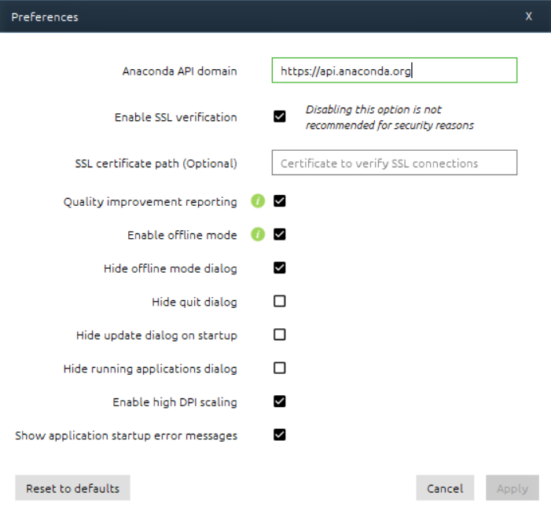{:width="70%" .mx-auto}

You should now see "_Working in offline mode_" appear in the top right. Offline mode should persist when you open Anaconda Navigator again.

## Change Jupyter Home Directory

By default, Jupyter Notebook will start up with `C:\` as its home directory. Only files within `C:\` will be accessible using the Notebook Dashboard. You most probably will want to store your notebooks in your VRE's shared storage (`N:\`), where your data will also be stored. To view `N:\` in the Notebook Dashboard, you can simply change directory to `N:\` before starting `jupyter notebook`:

- Open Anaconda Prompt and activate your conda environment using instructions above.
- Change directory to your VRE's shared storage by typing `N:` and hitting the enter key.
- Your prompt should change to `N:\>`.
- Type `jupyter notebook` in Anaconda Prompt and hit enter to open Jupyter Notebook.

The instructions above are simple but will not persist, meaning you must change directory to `N:\` every time. To permanently make jupyter notebook open showing `N:\` as your home directory, perform the following steps:

- Open Anaconda Prompt and activate your conda environment.
- Run `jupyter notebook --generate-config`.
- This writes a file to `C:\Users\<username>\.jupyter\jupyter_notebook_config.py`.

    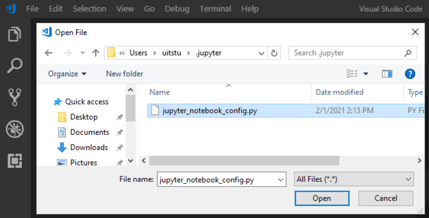

- Open this file in an editor and search for the `c.NotebookApp.notebook_dir` config setting.
- Put the file path for your desired home directory in the empty string, using forward slashes. E.g., `N:/`
- Uncomment the setting by removing the hash (#).
- Where the line previously was `#c.NotebookApp.notebook_dir = ''` will now be `c.NotebookApp.notebook_dir = 'N:\'` or similar.
- Save the change and close the file.
- Run `jupyter notebook` in Anaconda Prompt, while your environment is active, and the Notebook Dashboard should appear showing your chosen home directory in the Dashboard file manager.
- This setting will apply for your user only, on that VM only. Another user, or the same user in a different VM in the same VRE will need to repeat these steps. The setting may apply to all conda environments.

## I can't see R: drive

You may need to manually map the R: drive to your machine.
- Open File Explorer and right click on Network  
	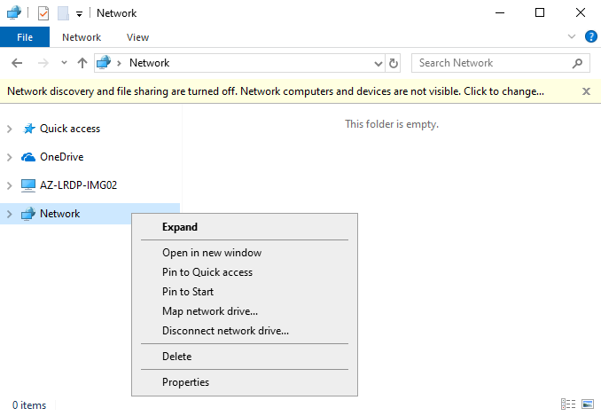
- Select 'Map network drive'
- Drive = R: 
- Folder = \\\azlrdprepos.file.core.windows.net\r-repo
	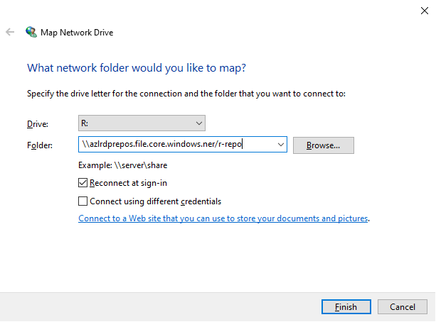
- Click finish 

You should now see the R miniCRAN repository mapped to R: drive.

## My software installation failed in Software Center

There is a known issue that with some software provided in Software Center, attempts to install the software end with Failed status and present an error message even when the installation is successful. This is known to occur with:

- ArcGIS
- Atom

If you have tried to install these software and got an error message try looking for the software in your Start menu to see if the installation actually succeeded. If the software didn't install, contact the Data Analytics Team at [dat@leeds.ac.uk](mailto:dat@leeds.ac.uk) for support. In all other cases of software installation failures, contact the Data Analytics Team.

## Where can I find the computational spec of my virtual machine?

See our guide to [monitoring VMs using Azure Portal](./az_portal/portal_vms.html).

## Why is my LASER desktop display a different resolution to the desktop I use to access LASER?

Windows often scales the display to make text larger and easier to read, altering the resolution displayed. By default, LASER displays VRE desktops at this scaled resolution rather than your monitor's native resolution.

To run LASER VMs at the native resolution of your monitor:

- Right-click the Citrix Workspace icon in the system tray on your taskbar, and select Advanced Preferences: 
{:width="70%" .mx-auto}
- Select High DPI, and then select and save the “No, use the native resolution” option: 
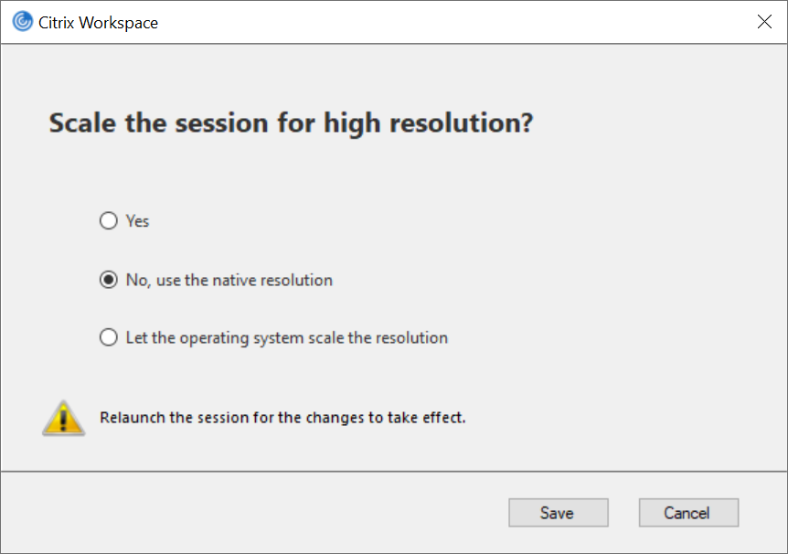{:width="70%" .mx-auto}

Your choice will persist in subsequent sessions.

## How do I restrict folder access to specific project members?

See our instructions on how to [request bespoke folder access permissions](./storage_drives.html#restrict-access-to-folder-on-n-drive) on your VRE's N: drive.

## There's a cost discrepancy between Azure Portal & LASER Dashboard

A variance between the LASER Power BI Dashboard costs which come directly from Azure and the monthly IT finance costs may be seen, this is due to discounts and surcharges included in IT Finances calculations as part of a 3rd party supplier contract but not part of the raw Azure costs.

