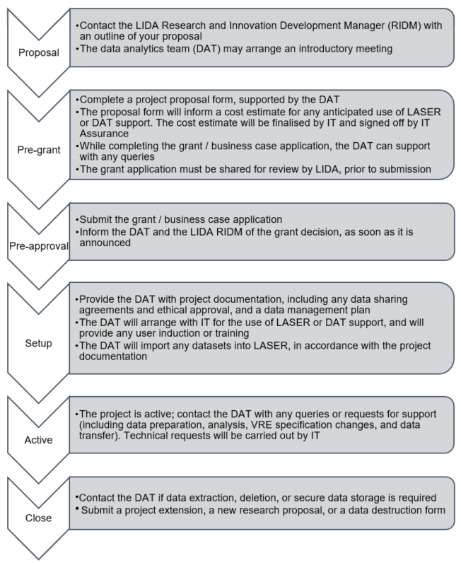

##LIDA Research Management Process

When a researcher contacts LIDA with a project proposal, this enters a 6-stage Research Management Process (RMP). The RMP takes the project through from the proposal and costing stages, through receiving the necessary funding and approval, to undertaking research in a secure environment and safely closing the project with destruction, dissemination and / or archiving of any project datasets. 

These are the 6 RMP stages and what you, as a researcher, will be involved in:

Here is more detail on each of the RMP steps:

**1. Proposal**
Contact the LIDA Research and Innovation Development Manager, Paul Evans, with a research proposal. Where this aligns with the LIDA business portfolio, the [DAT](mailto:ircdst@leeds.ac.uk) will be in touch to arrange an introductory meeting.

**2. Pre-grant**
The DAT will provide a project proposal form and guidance for its completion. The form will capture the classification of any data, any necessary regulatory compliance and computational resources, and any intended collaboration with the DAT, who offer experience in data management, analysis and modelling and writing research code. 

If the Leeds Analytics Secure Environment for Research (LASER) is the appropriate research location for your project’s data, then the DAT will scope the requirements and provide an indicative cost for inclusion within your grant proposal. Please allow for up to 5 days to receive a full costing as part of your grant development planning. The finalised form will be reviewed within LIDA and can then inform the grant application.

The DAT can help with any queries while completing the grant application or business case. Any sections of the application relating to LIDA will be reviewed within LIDA, in a timely manner, prior to submission. Please provide a copy of the final submission to LIDA. 

**3. Pre-approval**
After submitting the grant application, the project will be in the Pre-approval stage. Contact the DAT with any ongoing queries and upon receiving notification of successful funding, to move the project into the Setup stage.

**4. Setup**
The DAT will guide you in providing a Data Management Plan, any required ethical approval and Data Sharing Agreements, and in undertaking a Data Protection Impact Assessment for your project data, in compliance with the Data Protection Act 2018. These documents will undergo a risk assessment and review led by IT Assurance. 
If you will be using LASER, the DAT will request that IT build and test a Virtual Research Environment (VRE). All new users will need to sign a LASER user agreement and complete information security training, whereupon IT will enable VRE access. The DAT will provide an induction to LASER and LIDA, including to the safe room, as applicable. At this point, data can be prepared or requested for loading into the VRE.
The DAT is currently involved in receiving and importing any data into LASER, though the facility is being developed to enable researchers to undertake data transfer, depending on the security classification of the project data. If the VRE is classified in the top tier (Tier 4) of security, the DAT will apply checks to ensure the received data are complete and in accordance with the data sharing agreement, prior to data transfer.

**5. Active**
As you undertake the project research, you will be notified of any ongoing training requirements, and can contact the DAT for operational or technical support. The DAT may assist with any further data transfer (ingress or egress), data destruction, and any analytics or training requirements. 
The DAT can also support the use of scientific computing tools, including Python and R, within the VRE and will raise any technical requests with IT on your behalf, for example regarding software installation, data backup and changes in user or VRE resource allocation.

**6. Close**
Prior to the project end date, the DAT will request a status update, regarding the impending project completion. For projects using LASER, the options are to destroy the project VRE or extend it through either a project extension or a new research proposal. If the VRE is to be destroyed, you may first wish to arrange for data extraction for dissemination, storage or archiving. Non-sensitive data may be archived in the Research Data Leeds Repository. 
Once any data extraction is complete, and you have completed a VRE destruction request form, the DAT will request that IT undertake the destruction and will provide confirmation of destruction to the researcher. 
If you extend or develop the project through a new proposal, the project will return to step one of the RMP. The extension or new proposal may request that the VRE is continued, or that the project data be securely stored using Azure archive storage.
