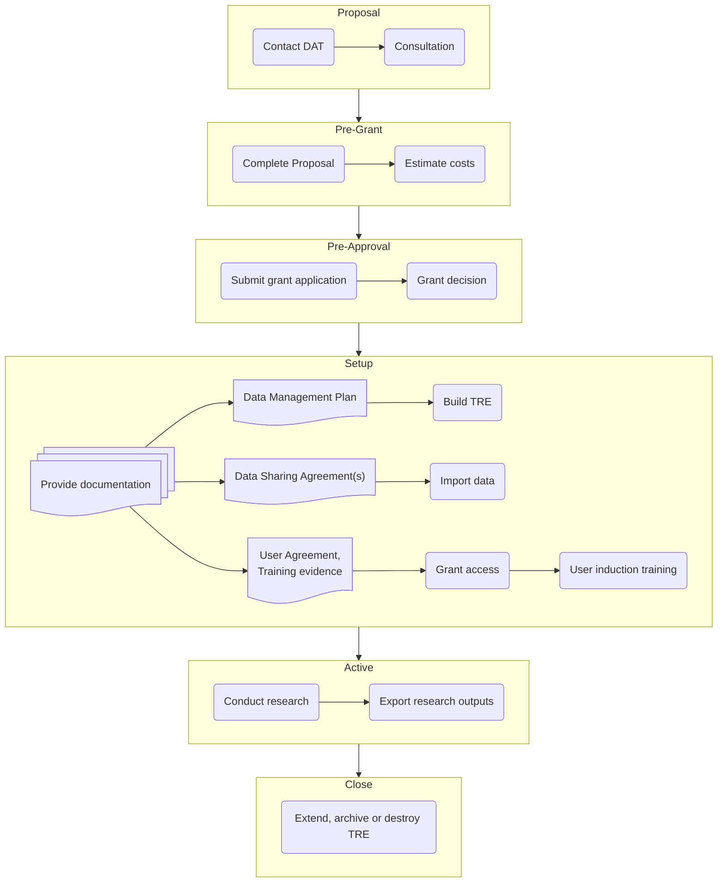

# LIDA Research Management Process
{:.no_toc}

When a researcher contacts LIDA with a project proposal, this enters a 6-stage Research Management Process (RMP). The RMP takes the project through from the proposal and costing stages, through receiving the necessary funding and approval, to undertaking research in a secure environment and safely closing the project with destruction, dissemination and/or archiving of any project datasets. 

These are the 6 RMP stages and what you, as a researcher, will be involved in:  

1. TOC
{:toc}

```mermaid
flowchart TD
    subgraph Proposal
    direction LR
    1(Contact DAT) 
        --> 2(Consultation)
    end

    subgraph Pre-Grant
    direction LR
    3(Complete Proposal) 
        --> 4(Estimate costs)
    end

    subgraph Pre-Approval
    direction LR
    5(Submit grant application)    
        --> 6(Grant decision)
    end

    subgraph Setup
    direction LR
        7@{ shape: docs, label: "Provide documentation"}
        7a@{ shape: doc, label: "Data Management Plan"}
        7b@{ shape: doc, label: "Data Sharing Agreement(s)"}
        7c@{ shape: doc, label: "User Agreement, <br> Training evidence"}
        8(Build TRE)
        9(Import data)
        10a(Grant access)
        10b(User induction training)
        7 --> 7a --> 8
        7 --> 7b --> 9
        7 --> 7c --> 10a --> 10b
    end

    subgraph Active
    direction LR
    11(Conduct research)
        --> 12(Export research outputs)
    end

    subgraph Close
    direction LR
    13(Extend, archive or destroy TRE)
    end

    Proposal --> Pre-Grant --> Pre-Approval --> Setup --> Active --> Close
```

Here are more details on each of the RMP steps:

## Proposal  
Contact the Data Analytics Team ([dat@leeds.ac.uk](mailto:dat@leeds.ac.uk)), with your idea for a research proposal. The DAT will respond to arrange an introductory meeting, if necessary, to discuss the project concept and if/how LASER might be appropriate.  

## Pre-grant  
If appropriate to continue exploring LASER and/or DAT Support the DAT will provide a Project Proposal Form and guidance for its completion. 

This form will capture project requirements including the [risk classification](docs/laser_info/tiering.md) of project data, any necessary regulatory compliance, computational resources, and any intended [collaboration with the DAT](docs/lida_services/dat.md).  

Using the requirements gathered during this stage the DAT will work with IT Services to provide an indicative cost for inclusion within your grant proposal.  

The DAT can help with any queries while completing the grant application or business case. Please provide a copy of the final submission to LIDA.  

## Pre-approval  
After submitting the grant application, the project will move to the Pre-approval stage. Contact the DAT with any ongoing queries and upon receiving notification of successful funding, to move the project into the Setup stage.  

## Setup  
Once funding has been successfully sourced, we can make a start on setting up your Trusted Research Environment.  

This stage is largely concerned with the collection of required documentation, including
- Data Management Plan / Data Protection Impact Assessment  
- Data Sharing Agreement(s) or appropriate equivalent  
- User docs consisting of:  
    - LASER User Agreement  
    - Evidence of mandatory training  

Once we have received a finalised DMP we will undertake a Risk Assessment and once satisfied all data risk is appropriately managed we can request IT Services build your Trusted Research Environment (TRE).  

We can only transfer data to your TRE once it has been built & tested and there are appropriate Data Sharing Agreements (or equivalent) in place to be able to demonstrate our legal right to process the data.  

Access to the TRE will be granted upon submission of the required [User Documentation](docs/laser_info/user_docs.md) and an offer of Induction Training will be made.  

DAT will be on hand at every step to offer guidance and support as necessary.  

## Active  
During the Active cycle of your project the DAT are on hand to assist with:  
- first line support including new user induction and training, troubleshooting and use of research tools  
- raise any technical requests with IT on researcher's behalf  
- [data imports](docs/laser_how_to/transfer/index.md) including compliance checks (against data sharing agreements and other contractual/legal obligations)  
- [data exports](docs/laser_how_to/transfer/index.md) including disclosure and compliance checks  
- audit of user training and project compliance  
- review of resource allocation and changes to TRE configuration  
- data destruction and completion of required assurances  

## Close  
Prior to the project end date the DAT will request a status update regarding the impending project completion.  

For projects using LASER, the options are to: 
- Continue as is with a new end date. 
- Mothball for a defined period (no access, reduced costs).
- Destroy TRE (and all data) and end cost accrual. 
