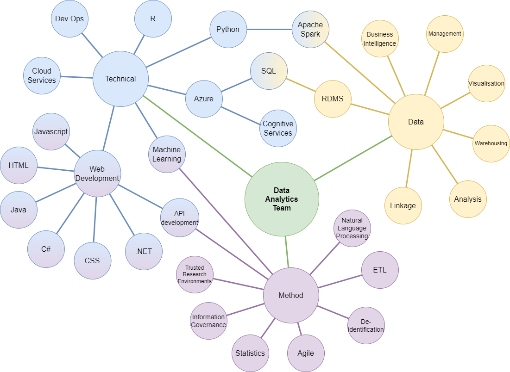

# Data Analytics Team 
LIDA’s Data Analytics Team (DAT) have expertise across different areas of data management, analytics, research software engineering and information governance. These skills are complemented by their experience of working within specific domains, including health and urban analytics.  

||
|:--:|
| _Map of skills & competencies within the DAT_ |

DAT members can provide support to researchers at the grant opportunity stage right through to project delivery. If successful, members of the DAT team are assigned to projects based on individual project requirements. Being strategically aligned to the key domains of LIDA research activity enables DAT to provide specialist insight for grant applications and scholarly publications.  

The Team also provide support and advice for use of the LASER platform and have key responsibilities in operationalising the LIDA Information Governance Framework.

## Contact
Please feel free to reach out to a member of the DAT at [dat@leeds.ac.uk](mailto:dat@leeds.ac.uk)

## Meet the team!

### Adam Keeley
**Role** : Data Analytics Team Manager  
**Areas of RSE technical research interests** : Cloud computing, data management, Trusted Research Environments, ML/AI.  
**Summary of experience** : Graduating from University of Leeds in Environmental Science Adam then spent many years working in the private sector, predominantly in Management Information and bulk data handling within heavily regulated sectors. He joined LIDA in 2016 as a Data Analyst and worked collaboratively with researchers with a focus on ETL processes (including de-identification/pseudonymisation), data management and linkage. He's been supporting research using sensitive data in a safe way throughout his time in LIDA and continues to support the Data Analytics Team to do the same.  
**Areas of Primary expertise** : Proficient in the use of relational database management systems to build data warehouses and create models for research/reporting Adam can utilise the full BI Stack to automate data flows and reporting processes. Well versed in information governance concerns he can advise academic researchers and third party data partners on best practice for safe research using personally identifiable or commercially sensitive data from pre-grant to closure.  
**Areas of Secondary expertise** : Software development in C# and related languages, as well as some experience using Python for data management and processing.  

### Chris Andrew
**Role** : Research Software Engineer  
**Areas of RSE technical research interests** : Data modelling, data engineering, data management, API development, cloud computing & machine learning.  
**Summary of experience** : Since graduating in Physics with Ocean and Climate Science from the University of Liverpool, Chris worked in a range of engineering professions: mechanical, medical electronics, geophysical, and oceanographic, before settling on software engineering. This latter career has provided diverse experience building tools and managing data in commerce, logistics, and more recently developing systems for secure, clinical trial management and randomisation. He continues to support research through data & cloud infrastructure management on LIDA's Trusted Research Environment (TRE), LASER, alongside engineering software solutions to improve internal processes and deliver research output to the public.  
**Areas of Primary expertise** : Chris has experience of combining his understanding of transactional and analytical database modelling with his robust skills in SQL to build and deliver data warehousing solutions, reporting, business intelligence dashboards, and database performance optimisation. Working in RSE, Chris has developed skills in requirements gathering, solution design, and technical documentation production, which he has experience applying to software/web application development in C#/.NET and python. He is interested in implementing development best practice through Agile methodologies, providing peer/researcher support, writing constructive code reviews and more generally, enjoying the process.  
**Areas of Secondary expertise** : While his technical experience also extends to the Java & Javascript languages and frontend web development, he continues to deepen his understanding of DevOps, statistics, analytics, ML, and the R language. 

### Ifeanyi Chukwu
**Role** : Research Software Technician  
**Areas of RSE technical research interests** : Machine Learning/Artificial Intelligence, Data modelling, Cloud computing, data linkage, data managment, Secure Research Environment.   
**Summary of experience** : Currently supporting researchers through the Research management process and managing researchers’ resources and project flow on LASER. Supporting the data security standards such as GDPR, NHS DSPT, and ISO27001 for various projects. Before joining the DAT team in April 2022, Ifeanyi was a data scientist within the LIDA Data Scientist Development Programme. During this time he worked on a HDR-UK/DATA-CAN project using LTHT cancer referrals data and the national cancer referrals registry data, and participated in Alan Turing Data Study Groups. During this time he worked on a health & societies-related project – considering urgent cancer referrals, covid19 pandemic, and patient geodemographics.  
**Areas of Primary expertise** : Data Science skills such as data wrangling and manipulation, data visualization, machine learning (supervised and unsupervised learning), and apache spark for managing very large-scale data. Python (including Jupyter notebook), R-studio and SQL. Data security and data risk disclosure including pseudonymization expertise. Data linkage.  
**Areas of Secondary expertise** : Natural Language Processing, and Cognitive Services.  

### Fojan Ilderem
**Role** : Research Software Technician  
**Areas of RSE technical research interests** : Cloud Services, Machine Learning, MLOps, and Data Visualisation.  
**Summary of experience** : Fojan is a data science professional with experience supporting researchers through the research management process and data management flow on LIDA Analytics Secure Environment for Research (LASER). Fojan also has experience in compliance with data security standards such as GDPR and ISO27001, having worked on various projects in adherence to these regulations. Prior to their career in data science, she worked as an electronics engineer and lab manager in a research and development institute, where she specialized in developing autonomous agricultural machinery. She holds a postgraduate degree in semiconductor devices and optoelectronics and has experience working with a wide range of microcontrollers.  
**Areas of Primary expertise** : Well-versed in Amazon Web Services, Lambda, API Gateway, and DynamoDB, as well as Java full-stack development using the Spring framework, Fojan has developed web applications that are both scalable and secure. She also has experience in data science techniques, using Python and R programming for exploratory data analysis, clustering, classification, and regression analysis. Additionally, she is experienced in both relational and non-relational databases as data backends for analytics and software development projects.  
**Areas of Secondary expertise** : Experience in Reinforcement Learning for autonomous driving based on AWS; Front-end development using HTML, CSS, and JavaScript, Data Visualisation.  
