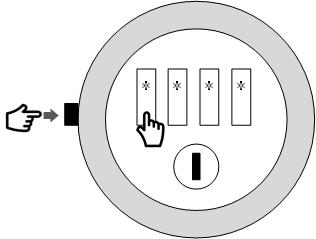

# Safe Rooms 

## What is a safe room used for?
When data has been classified as Tier 4 (see [LASER Data Risk Tiering](../laser_info/tiering.html)) a researcher will only be able to access the data from a controlled environment where the risks of data leakage can be controlled.

## Opening Times    
8.30 a.m. to 5 p.m. weekdays 

## Bookings and use of the Safe Rooms
Both the LIDA Reception staff and the Data Services Team can book safe rooms.  These are:

- Room 11.15
- Room 11.16
- Room 11.83	

Photo ID will be requested to evidence user identity. The type of ID may vary depending on the user:
- Internal (University members) users
	- Staff card
- External users
	- Driving license
	- passport
	- other recognised national identification card

Key fobs are provided to access the safe rooms. These will be signed out by reception staff at the start of each session and you must return them at the end of the session. A record will be kept of which users access which room and when.

External researchers must present a signed copy of the [Health and Safety.pdf](../../files/Safe Room Health and Safety Information.pdf) to front desk upon first arrival to LIDA to use the safe room.

## Regulations
There are a number of regulations in place that the user must adhere to in order to maintain the integrity of the data being accessed and the reputation/standards of the IRC. These are as follows:
- All personal items must be stored in the lockers provided on site (see below). These include (but not limited to) mobile phones, laptops, tablets and baggage.
- All means of recording data, including pen/pencil and paper, are prohibited, and must also be kept in the lockers provided.
- CCTV is in operation, including outside the safe rooms.
- The safe rooms are locked and can only be accessed by permitted users. These can be accessed by fob key, which will be allocated at the beginning of each session. The rooms can be opened from the inside without use of the fob

## Lockers
Lockers are available outside the safe rooms. ​To unlock an unused locker, set the combination lock to 3333 and turn the lock clockwise or anti-clockwise a one quarter turn.

To secure personal belongings the lock will need to be set with a personal code. To set a new combination code, hold the button on the left in, set a new 4 digit number and then release the button. Scramble the code immediately after closing the door.

                      
After the locker has been used, please reset the code back to factory defaults using the above instructions. In case the code was forgotten the locker can be opened by reception staff using a service key.

## In case of an Emergency 
For lone workers, if you need help in an emergency you can press the red button within the safe room to raise the alarm.
