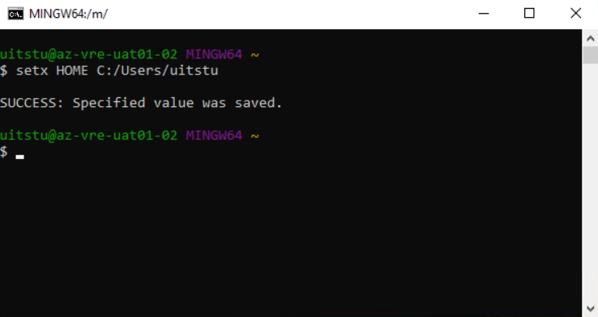
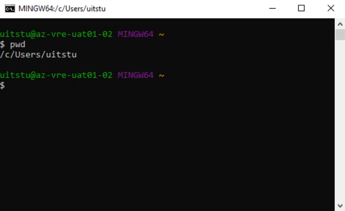
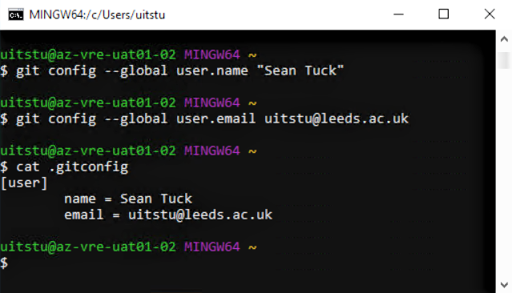
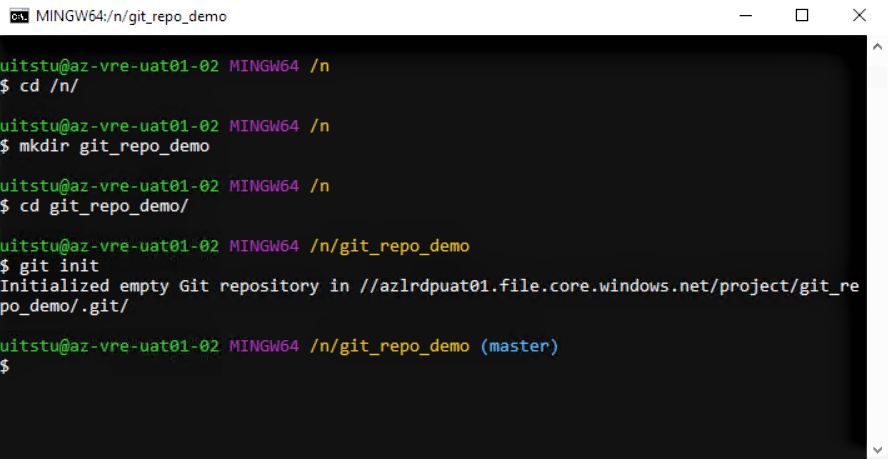

## Setting up Git for Version Control

To use Git for version control in a LASER VRE, first check Git has been installed via [Software Center](./install_software.html). Once installed, you'll need to change Git's home directory and configure your own user name and email address (used to identify person committing changes to code). You'll only need to do this once.

Open Git Bash to begin.

## Change Git home directory

When you first open Git Bash it will open to your home directory, which by default will be `M:\`. This does not point to a folder specific to your user account. To change this, run the following command, replacing `<username>` with your UoL username:
`setx HOME C:/Users/<username>`

You should see a message confirming you successfully change the home directory.

{: .mx-auto }

Now close Git Bash and reopen it again to refresh your settings. It should reopen to your new home directory. You can check using `pwd`.

{: .mx-auto }

When you make changes to your user configurations, they will be saved to your new home directory.

## Update user config

To identify yourself when you commit changes to code, declare your user name and email in a gitconfig file. These configurations will then get used automatically when using Git.

Run the following commands in Git Bash:
`git config --global user.name <your-name>`
`git config --global user.email <your-email>`

This will create a file called .gitconfig in your home directory, or add to the file if it already exists. From your home directory in Git Bash, check the contents of .gitconfig using `cat .gitconfig`.

{: .mx-auto }

## Using Git

You can then use Git as you would normally on another machine. **We strongly recommend you always store your Git repositories and all other files in your project shared storage (`N:\`).** Navigate to your shared storage and initialise a Git repository like so:

{: .mx-auto }
