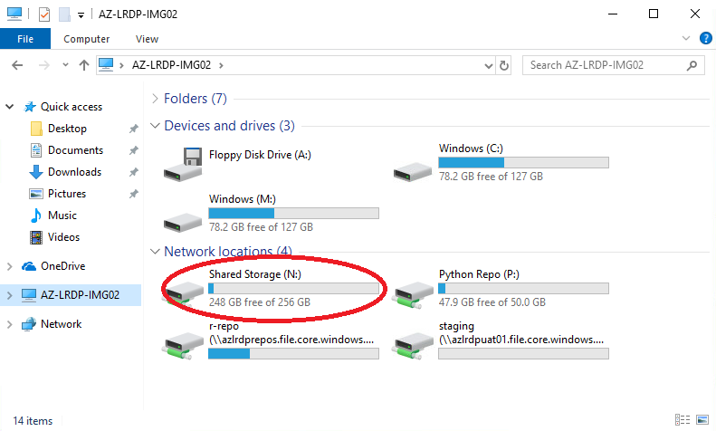

## Where is my project data?

If you open up File Explorer and click on the computer name on the left, you will see a list of drives (C:, M: etc.)

Your shared project storage can be found on the N: drive, as highlighted in the image below.

N: drive is shared across all VMs in your VRE.

We recommend saving all of your documents to the N: drive so that they benefit from the higher level backup schedule and remain available to the rest of your team. 

The C: drive is the operating system storage and does not benefit from the same backup retention schedule as project storage. Please refrain from saving any files here.

M: drive is similarly existant on the virtual machine only and should be avoided.

R: and P: drives relate to package repositories that you will only have read access to.
