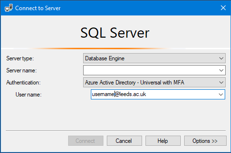
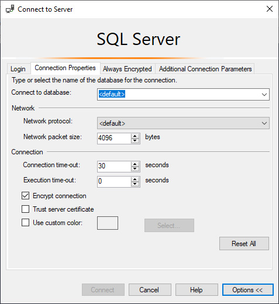

## Connect to database via SSMS

When SSMS opens you will be prompted for the connection details.   


Enter the following:
- Server type = Database Engine
- Server name = \<ServerName>.database.windows.net
- Authentication = Azure Active Directory - Integrated

Click 'Options >>' and go to the second tab 'Connection Properties'.  


Change 'Connect to database' from \<default> to the name of your database.

Click 'Connect' and your database will appear in the Object Explorer.

## Connect to database via ODBC

Your connection string will need to include at least:  
- Server name
- Database name
- Driver name 
- Authentication type

Azure SQL Database server names take the form `<ServerName>.database.windows.net`.

LASER uses _'Azure Active Directory - Integrated'_ authentication to enable Contained Users to connect to Azure SQL Databases.

Few ODBC drivers currently support 'Azure Active Directory - Integrated' authentication, including 'SQL Server Native Client 11.0'. A driver that does support it is '**ODBC Driver 17 For SQL Server**', so this must be specified in your connection string.

### Examples

Example connection string: 
```
conn = "DRIVER={ODBC Driver 17 for SQL Server}; SERVER=tcp:<Server Name>.database.windows.net; DATABASE=<Database Name>; AUTHENTICATION=ActiveDirectoryIntegrated"
```

Example Python function to upload a *.csv file to Azure SQL Database using pandas & sqlalchemy:  

```
import pandas as pd
from sqlalchemy import create_engine
import urllib

def csv_to_sql(file, sql_server, sql_database, sql_schema, sql_tablename): 
        conn = urllib.parse.quote_plus("DRIVER={ODBC Driver 17 for SQL Server};SERVER=tcp:" + sql_server + ";DATABASE=" + sql_database + ";Authentication=ActiveDirectoryIntegrated")
        engine = create_engine("mssql+pyodbc:///?odbc_connect=%s" % conn, fast_executemany=True)
        for chunk in pd.read_csv(file, chunksize=chunksize):
            df = pd.DataFrame(chunk)
            df.rename(columns=df.iloc[0])
            df.to_sql(sql_tablename, con = engine, if_exists = "append", schema = sql_schema, index = False)
```
