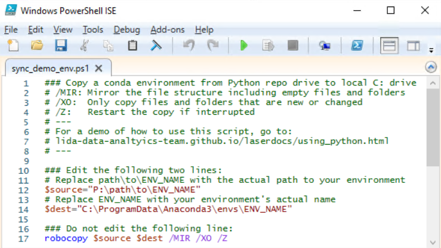
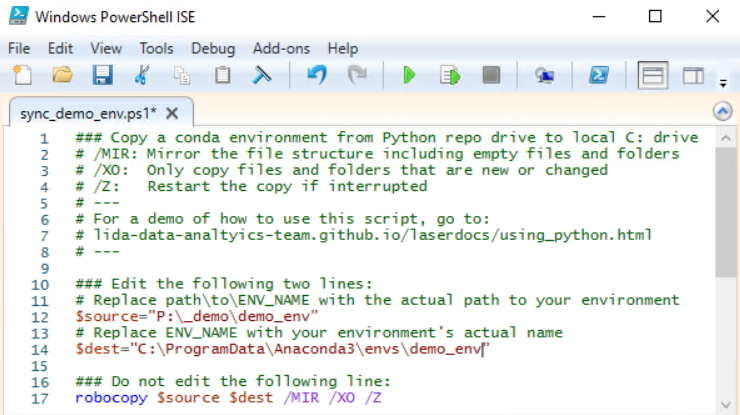
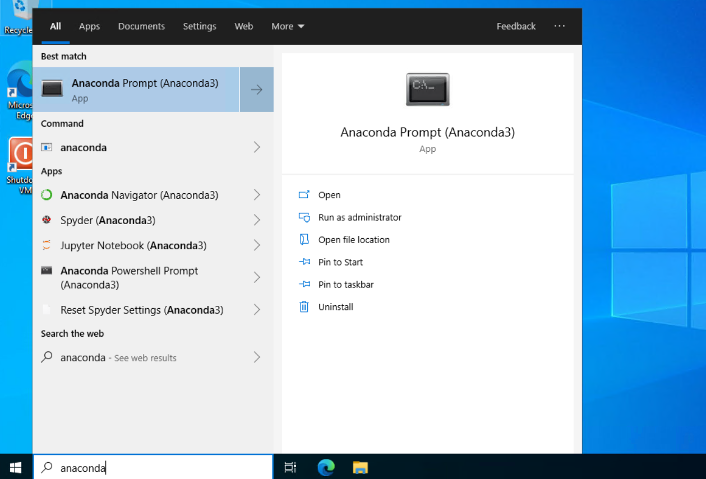
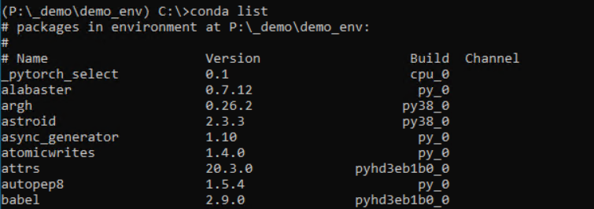
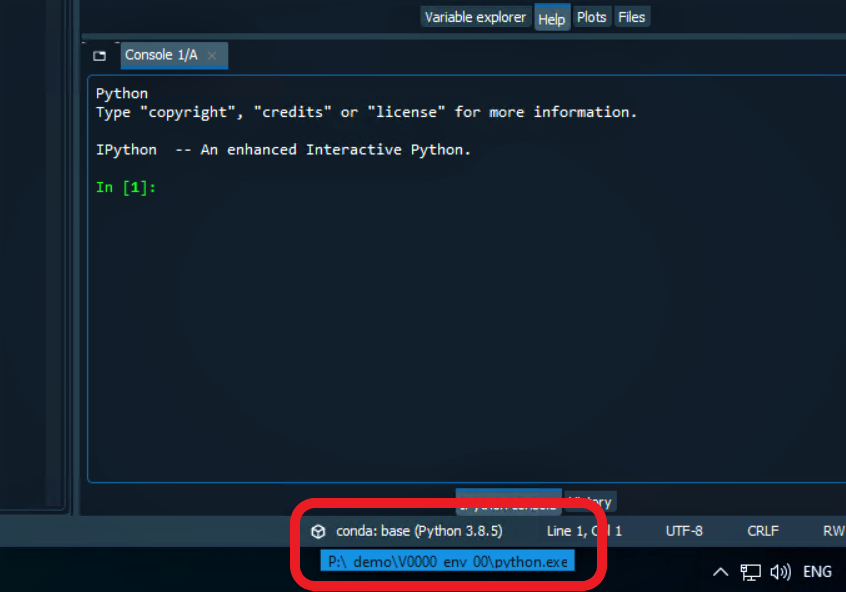
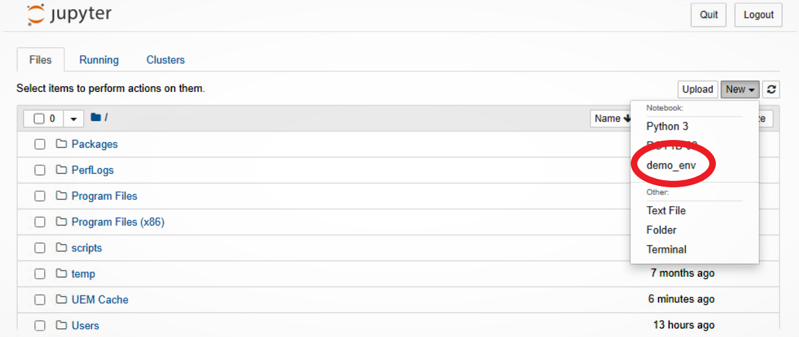
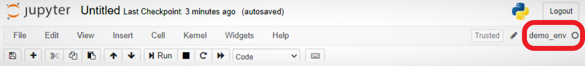

## Using Python in LASER
{:.no_toc}

Python is distributed to LASER users via Anaconda, a distribution of several scientific computing technologies. Anaconda contains out of the box a version of Python and many of the most popular modules in data science and research. This basic installation is called its base environment.

Environments encapsulate the software dependencies of your project's code, making your project more reproducible. Conda environments are Anaconda's answer to Python virtual environments (much like pipenv).

There is no internet connection in the VREs needed to create your own environments. Instead, any Python modules that you need can be provided in bespoke environments. Contact the [LIDA Data Analytics Team](mailto:ircdst@leeds.ac.uk) to request new Python modules and they will be added to your project's environment. (We can provide the same environments for R, if you like - but, see also the [R repository](install-r-package.md)).

All bespoke conda environments are stored in LASER's Python repository, on the `P:\` drive. Within the Python repo, you'll find a subfolder for your VRE (e.g., V0001), containing all your requested environments.

Details follow on how to use conda environments in various ways.

* seed list
{:toc}

### Syncing conda in local storage

For performance reasons, we recommend creating a mirror of your environment in the VM's local C: drive. This involves copying from the Python repo P: drive to a folder on the C: drive where Anaconda stores environments. We have created a script template that uses a Windows command to sync your local copy, meaning each time your environment in the Python repo is updated, you can run this command to copy across only the new changes.

The script template is filed in the Python repo at P:\sync_conda_template.ps1. Copy and paste this file to somewhere you can readily access, such as your desktop. Then rename the file to be specific to your chosen environment, e.g. sync_demo_env.ps1.

Right-click your new file and select Edit to open the file in Powershell ISE. You'll see a script that looks like this:

{:width="70%" .mx-auto}

Edit the file paths stored in the `source` and `dest` variables, according to the instructions in the file. For example, there is a demo environment on the Python repo that you can sync locally by editing the file paths in the script as follows:

{:width="70%" .mx-auto}

Close the file editor. Right-click the file again and select Run with Powershell. This will open a Powershell prompt window and run the script. You'll see information about files being copied. The first time you copy across a conda environment, this will take some time, maybe 30 mins or longer. Future copies will take a few minutes or less, as fewer files will be new or updated with each copy. Once it's finished, the printed output will show you how many files were copied and how long it took. You now have a local copy of your conda environment. Close the Powershell window. 

### Using conda at the command line

- Open Anaconda Prompt (cmd) from the Start menu by typing anaconda in the search bar and selecting it from the results.

    

- If you haven't followed the above steps to sync your conda environment in local storage, activate your conda environment by passing the full path to your environment stored in the Python repo. E.g.:
`conda activate P:\_demo\demo_env`
- If you have synced your environment locally, activate it using the environment's name, not a full path: 
`conda activate demo_env`
- **Hereafter, screenshots of using a conda environment show use of an environment from the P: drive. If you have synced locally, always use the enviroment name instead.**
- You should then see the name of your conda environment in the prompt, shown in parentheses where it previously said "base".
- You can check that the environment contains the software you need by running `conda list`.

    

- Run Python code in the command line using the `python` command, like you normally would.
- Use this environment as you would use any other. Instructions on how to use your environment in various Python IDEs are below.
- To deactivate the environment, type:
`conda deactivate`

### Using conda in Spyder

- Activate your conda environment using Anaconda Prompt, following the instructions above.
- In Anaconda Prompt, with your environment active, type `spyder` and hit enter to load Spyder.
- Spyder will then have access to all of the modules and dependencies for your project. Create Spyder projects and use them as you normally would.
- To check Spyder is correctly using your environment, hover over the name of the active Python interpreter in the bottom status bar and the file path that appears should show the python.exe within your environment:

    

### Using conda in Jupyter Notebook

- Activate your conda environment at the command line.
- The first time you want use your environment in a jupyter book, you'll first need to install an ipython kernel by running:
 `ipython kernel install --user --name=<env-name>` 
Where `<env-name>` can be replaced with a name of your choice. We recommend you use the same name as your environment, but not the full path (i.e., for an environment at P:\_demo\demo_env name your ipython kernel demo_env).
- You won't need to install a new kernel in the future.
- If you want to change Jupyter Notebook's home directory, work through the [instructions below](./using_python.html#change-jupyter-home-directory) before moving to the next step.
- Type `jupyter notebook` to load Jupyter using your environment.
- Jupyter Notebook will open.
- Navigate to a folder where you want to create a new notebook.
- Click New and then select your environment's kernel from the dropdown.

    

- A new notebook will open, which will have access to all the software in your environment.
- Check your notebook is using the right kernel by looking at the kernel name in the top right.

    

#### Change Jupyter Home Directory
{:.no_toc}

By default, Jupyter Notebook will start up with `C:\` as its home directory. Only files within `C:\` will be accessible using the Notebook Dashboard. You probably will want to store your notebooks in your VRE's shared storage (`N:\`), where your data will also be stored. To view `N:\` in the Notebook Dashboard, you can simply change directory to `N:\` before starting `jupyter notebook`:

- Open Anaconda Prompt and activate your conda environment using instructions above.
- Change directory to your VRE's shared storage by typing `N:` and hitting the enter key.
- Your prompt should change to `N:\>`.
- Type `jupyter notebook` in Anaconda Prompt and hit enter to open Jupyter Notebook.

The instructions above are simple but will not persist, meaning you must change directory to `N:\` every time. To permanently make jupyter notebook open showing `N:\` as your home directory, perform the following steps:

- Open Anaconda Prompt and activate your conda environment.
- Run `jupyter notebook --generate-config`.
- This writes a file to `C:\Users\<username>\.jupyter\jupyter_notebook_config.py`.

    

- Open this file in an editor and search for the `c.NotebookApp.notebook_dir` config setting.
- Put the file path for your desired home directory in the empty string, using forward slashes. E.g., `N:/`
- Uncomment the setting by removing the hash (#).
- Where the line previously was `#c.NotebookApp.notebook_dir = ''` will now be `c.NotebookApp.notebook_dir = 'N:\'` or similar.
- Save the change and close the file.
- Run `jupyter notebook` in Anaconda Prompt, while your environment is active, and the Notebook Dashboard should appear showing your chosen home directory in the Dashboard file manager.
- This setting will apply for your user only, on that VM only. Another user, or the same user in a different VM in the same VRE will need to repeat these steps. The setting may apply to all conda environments.

### Anaconda Navigator Offline Mode

When you first open Anaconda Navigator in a VRE, it will take some time to load. This is because the VRE is an offline environment and Anaconda Navigator expects an internet connection. You can improve your user experience of Navigator in the VRE by enabling offline mode.

After loading Anaconda Navigator, go to File > Preferences (shortcut CTRL+P).

Check the box to "Enable offline mode", then select Apply and close the preferences pane.

{:width="70%" .mx-auto}

You should now see "_Working in offline mode_" appear in the top right. Offline mode should persist when you open Anaconda Navigator again.
